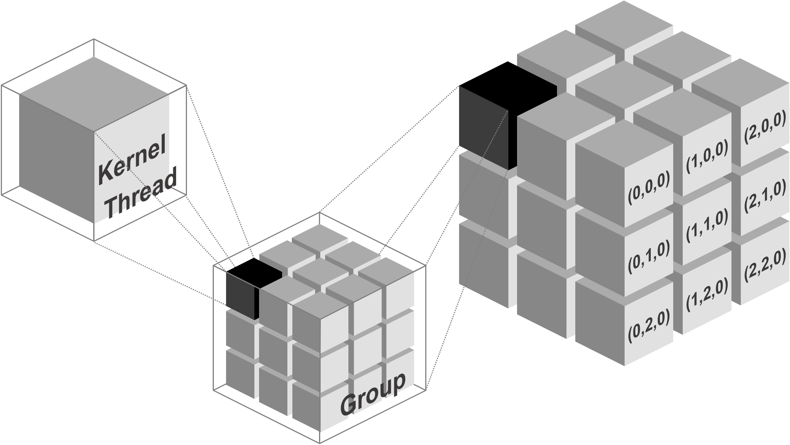
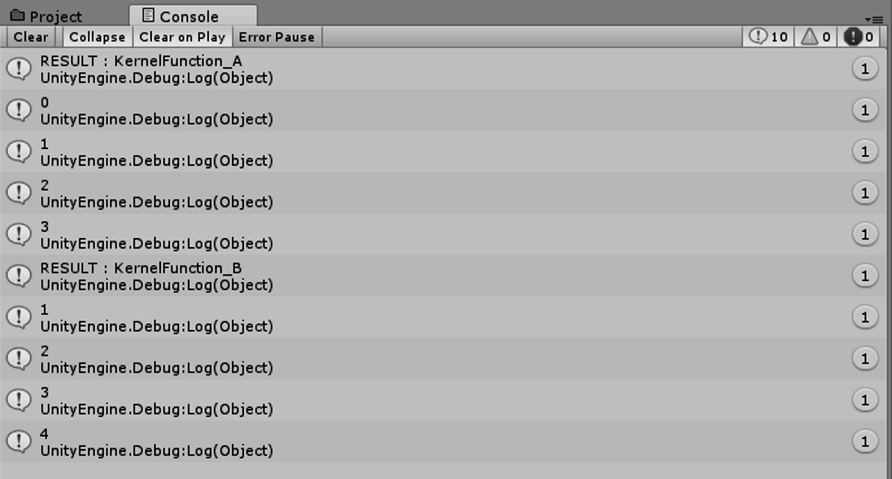
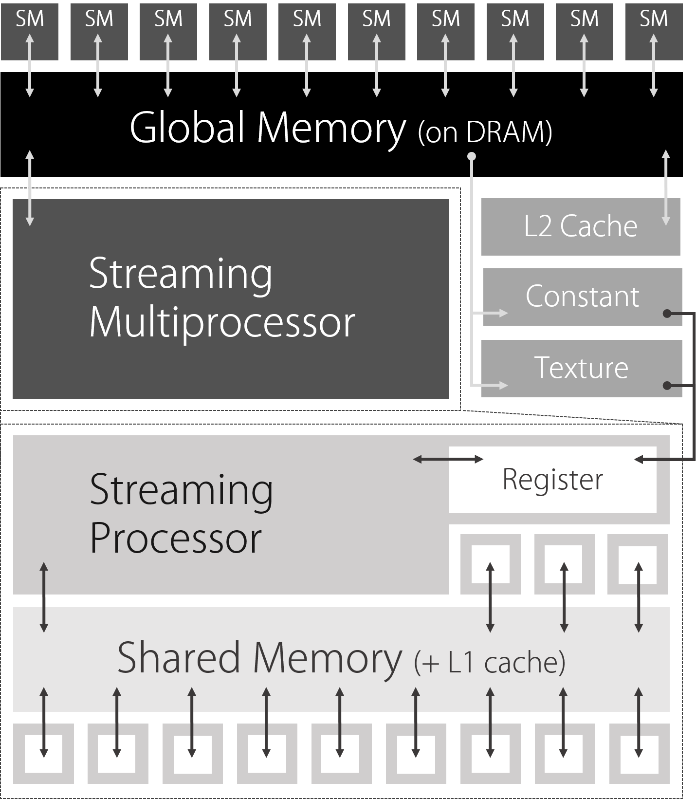

# Chapter 2: Introduction to Compute Shaders

*Original author: @XJINE*
*Translation and annotations by Claude*

---

## Overview

This chapter provides a straightforward explanation of how to use Compute Shaders in Unity.

A **Compute Shader** uses the GPU to parallelize simple operations and execute massive amounts of calculations at high speed. While it delegates processing to the GPU, it differs from the traditional rendering pipeline—this is its key characteristic. In computer graphics, compute shaders are commonly used for things like expressing the movement of large numbers of particles.

Several later chapters in this book use compute shaders, so understanding the concepts here is essential for following along.

This chapter serves as your first stepping stone into learning compute shaders, using two simple samples to explain the basics. These samples don't cover everything about compute shaders, so you'll want to supplement your knowledge as needed.

Unity calls these "ComputeShaders," but similar technologies include OpenCL, DirectCompute, and CUDA. The fundamental concepts are similar across all of these, and DirectCompute (DirectX) is particularly closely related. If you need more detailed information about the underlying architecture, looking into these technologies together would be helpful.

The sample code for this chapter is in the "SimpleComputeShader" folder at: https://github.com/IndieVisualLab/UnityGraphicsProgramming

> **💡 Why Compute Shaders Matter**
>
> Traditional GPU programming (vertex shaders, fragment shaders) is designed around the rendering pipeline—transforming vertices and coloring pixels. Compute shaders break free from this constraint. They let you use the GPU as a general-purpose parallel processor for *any* calculation, not just rendering.
>
> Think of it this way: a modern GPU has thousands of cores. A CPU might have 8-16. If your problem can be broken into thousands of independent pieces, compute shaders can be orders of magnitude faster than CPU code.

---

## The Concepts: Kernels, Threads, and Groups


*Figure: Visualization of Kernels, Threads, and Groups*

Before diving into implementation details, we need to explain the concepts of **Kernel**, **Thread**, and **Group** that are used in compute shaders.

### Kernel

A **kernel** refers to a single operation executed on the GPU, and in code, it's treated as a single function (this corresponds to the general systems programming meaning of "kernel").

> **💡 Think of it simply:** A kernel is just a function that runs on the GPU instead of the CPU.

### Thread

A **thread** is the unit that executes a kernel. One thread executes one kernel. With compute shaders, you can execute a kernel across multiple threads simultaneously in parallel.

Threads are specified in 3 dimensions: (x, y, z).

For example:
- `(4, 1, 1)` means 4 × 1 × 1 = **4 threads** execute simultaneously
- `(2, 2, 1)` means 2 × 2 × 1 = **4 threads** execute simultaneously

Both result in 4 threads, but depending on the situation, the second approach (specifying threads in 2 dimensions) can be more efficient. We'll explain this later. For now, just understand that thread counts are specified in 3 dimensions.

> **💡 Why 3 dimensions?**
>
> The 3D specification maps naturally to many GPU problems:
> - **1D (x, 1, 1)**: Processing arrays, audio samples, particle lists
> - **2D (x, y, 1)**: Processing images, textures, height maps
> - **3D (x, y, z)**: Processing volumes, voxels, 3D simulations
>
> You'll almost always use 1D or 2D. 3D is for specialized volumetric work.

### Group

A **group** is a unit that executes threads. The threads executed by a particular group are called **group threads**.

For example, if a group has `(4, 1, 1)` threads, and there are 2 such groups, each group has its own set of `(4, 1, 1)` threads.

Groups are also specified in 3 dimensions, just like threads. For example, if `(2, 1, 1)` groups execute a kernel with `(4, 4, 1)` threads:
- Number of groups: 2 × 1 × 1 = **2 groups**
- Each group has: 4 × 4 × 1 = **16 threads**
- Total threads: 2 × 16 = **32 threads**

> **💡 Why separate Groups and Threads?**
>
> This hierarchy exists because of GPU hardware architecture:
> - **Threads within a group** can share fast "shared memory" and synchronize with each other
> - **Threads in different groups** cannot easily communicate
>
> When you dispatch a compute shader, you specify the number of *groups*. The number of threads per group is defined in the shader itself. This separation gives you flexibility in how work is divided.

---

## Sample 1: Retrieving Computed Results from the GPU

Sample 1, "SampleScene_Array," demonstrates how to execute arbitrary calculations in a compute shader and retrieve the results as an array.

This sample includes the following operations:
- Process multiple pieces of data using a compute shader and retrieve the results
- Implement multiple functions in a single compute shader and use them selectively
- Pass values from a script (CPU) to the compute shader (GPU)

The execution result is debug output only, so please verify the behavior while reading the source code.


*Figure: Sample 1 execution result*

### Compute Shader Implementation

Let's walk through the sample. The compute shader code is very short, so it's best to read through it entirely first. The basic structure consists of: function definitions, function implementations, buffers, and optionally, variables.

**File: `SimpleComputeShader_Array.compute`**
```hlsl
#pragma kernel KernelFunction_A
#pragma kernel KernelFunction_B

RWStructuredBuffer<int> intBuffer;
int intValue;

[numthreads(4, 1, 1)]
void KernelFunction_A(uint3 groupID : SV_GroupID,
                      uint3 groupThreadID : SV_GroupThreadID)
{
    intBuffer[groupThreadID.x] = groupThreadID.x * intValue;
}

[numthreads(4, 1, 1)]
void KernelFunction_B(uint3 groupID : SV_GroupID,
                      uint3 groupThreadID : SV_GroupThreadID)
{
    intBuffer[groupThreadID.x] += 1;
}
```

Notable features include the `numthreads` attribute and the `SV_GroupID` semantics, which we'll explain below.

> **💡 Reading Compute Shader Syntax**
>
> If you're coming from regular C# or C++, this syntax might look strange. Here's a quick decoder:
> - `#pragma kernel` — Declares a function as a GPU kernel (entry point)
> - `RWStructuredBuffer<int>` — A read-write array that lives on the GPU ("RW" = Read/Write)
> - `[numthreads(4, 1, 1)]` — An "attribute" that sets how many threads run this function
> - `uint3 groupID : SV_GroupID` — A parameter with a "semantic" that tells the GPU what value to inject

### Kernel Definition

As explained earlier, a **kernel is a single operation executed on the GPU, treated as a single function in code**. You can implement multiple kernels in a single compute shader.

In this example, `KernelFunction_A` and `KernelFunction_B` are the kernels. Functions that should be treated as kernels are defined using `#pragma kernel`. This distinguishes kernels from other helper functions.

Each defined kernel is assigned a unique index for identification. Indices are assigned in order from top to bottom as 0, 1, ... based on the order of `#pragma kernel` declarations.

### Preparing Buffers and Variables

You need to create a **buffer area** to store results from compute shader execution. In the sample, `RWStructuredBuffer<int> intBuffer` serves this purpose.

> **💡 Understanding RWStructuredBuffer**
>
> - `RW` = Read/Write (the GPU can both read from and write to this buffer)
> - `Structured` = It holds structured data (as opposed to raw bytes)
> - `Buffer<int>` = It's an array of integers
>
> There's also `StructuredBuffer<T>` (read-only) for data you only need to read on the GPU.

If you want to pass arbitrary values from the script (CPU) side, you prepare variables just like in regular CPU programming. In this example, `intValue` serves this purpose, receiving its value from the script.

### Specifying Thread Count with numthreads

The `numthreads` **attribute** specifies how many threads execute the kernel (function). Thread count is specified as (x, y, z). For example:
- `(4, 1, 1)` = 4 × 1 × 1 = 4 threads execute the kernel
- `(2, 2, 1)` = 2 × 2 × 1 = 4 threads execute the kernel

Both execute 4 threads, but we'll discuss the difference and when to use each approach later.

### Kernel (Function) Parameters

Kernel parameters have constraints and offer extremely limited flexibility compared to regular CPU programming.

The values following the parameters are called **semantics**. In this example, we've set `groupID : SV_GroupID` and `groupThreadID : SV_GroupThreadID`. Semantics indicate what kind of value the parameter holds, and you cannot change them to other names.

While you can freely define parameter names (variable names), you must set one of the semantics defined for compute shaders. In other words, you **cannot** define arbitrary typed parameters for reference within the kernel—you must choose from a limited set of predefined semantics.

- `SV_GroupID` — Indicates which group (x, y, z) the thread executing this kernel belongs to
- `SV_GroupThreadID` — Indicates which thread number (x, y, z) within the group is executing this kernel

For example, when executing `(4, 4, 1)` groups with `(2, 2, 1)` threads:
- `SV_GroupID` returns values in the range (0–3, 0–3, 0)
- `SV_GroupThreadID` returns values in the range (0–1, 0–1, 0)

> **💡 Common Compute Shader Semantics**
>
> | Semantic | Meaning |
> |----------|---------|
> | `SV_GroupID` | Which group am I in? (0 to numGroups-1) |
> | `SV_GroupThreadID` | Which thread am I within my group? (0 to numthreads-1) |
> | `SV_DispatchThreadID` | My global thread ID across ALL threads (most commonly used!) |
> | `SV_GroupIndex` | Flattened 1D index within my group |
>
> `SV_DispatchThreadID` is usually what you want—it gives you a unique ID for each thread across the entire dispatch.

There are other `SV_` semantics you can use, but we'll skip explaining them here. It's better to review them after understanding how compute shaders work.

- SV_GroupID - Microsoft Developer Network
  - https://msdn.microsoft.com/en-us/library/ee422449(v=vs.85).aspx
  - You can check different SV~ semantics and their values here.

### Kernel (Function) Processing Content

The sample assigns thread numbers sequentially to the prepared buffer. `groupThreadID` receives the thread number within a group. Since this kernel executes with `(4, 1, 1)` threads, `groupThreadID` receives values (0–3, 0, 0).

```hlsl
[numthreads(4, 1, 1)]
void KernelFunction_A(uint3 groupID : SV_GroupID,
                      uint3 groupThreadID : SV_GroupThreadID)
{
    intBuffer[groupThreadID.x] = groupThreadID.x * intValue;
}
```

This sample executes these threads in `(1, 1, 1)` groups (from the script, explained later). This means we execute just 1 group, and that group contains 4 × 1 × 1 threads. Consequently, `groupThreadID.x` receives values 0–3.

> **💡 What's happening here, step by step:**
>
> 1. We dispatch 1 group
> 2. That group has 4 threads (numthreads is 4,1,1)
> 3. All 4 threads run KernelFunction_A **simultaneously**
> 4. Thread 0 sets `intBuffer[0] = 0 * 1 = 0`
> 5. Thread 1 sets `intBuffer[1] = 1 * 1 = 1`
> 6. Thread 2 sets `intBuffer[2] = 2 * 1 = 2`
> 7. Thread 3 sets `intBuffer[3] = 3 * 1 = 3`
>
> All four assignments happen at the same time! That's the power of parallelism.

*Note: This example doesn't use `groupID`, but it receives the group count specified in 3 dimensions just like threads. Try assigning it to verify compute shader behavior.*

### Executing the Compute Shader from a Script

We execute the implemented compute shader from a script. The script side generally requires:

- Reference to the compute shader | `computeShader`
- Index of the kernel to execute | `kernelIndex_KernelFunction_A`, `kernelIndex_KernelFunction_B`
- Buffer to store compute shader execution results | `intComputeBuffer`

**File: `SimpleComputeShader_Array.cs`**
```csharp
public ComputeShader computeShader;
int kernelIndex_KernelFunction_A;
int kernelIndex_KernelFunction_B;
ComputeBuffer intComputeBuffer;

void Start()
{
    // (1) Store kernel indices
    this.kernelIndex_KernelFunction_A
        = this.computeShader.FindKernel("KernelFunction_A");
    this.kernelIndex_KernelFunction_B
        = this.computeShader.FindKernel("KernelFunction_B");

    // (2) Set up the ComputeBuffer to store calculation results
    // A buffer with the same type and name must be defined in the ComputeShader
    this.intComputeBuffer = new ComputeBuffer(4, sizeof(int));
    this.computeShader.SetBuffer
        (this.kernelIndex_KernelFunction_A,
         "intBuffer", this.intComputeBuffer);

    // (3) Pass parameters to the ComputeShader if needed
    this.computeShader.SetInt("intValue", 1);
    ...
}
```

### Getting the Kernel Index

To execute a kernel, you need index information to identify it. Indices are assigned from 0, 1, ... in order of `#pragma kernel` definitions from top to bottom, but using the `FindKernel` function from the script side is recommended.

```csharp
this.kernelIndex_KernelFunction_A
    = this.computeShader.FindKernel("KernelFunction_A");

this.kernelIndex_KernelFunction_B
    = this.computeShader.FindKernel("KernelFunction_B");
```

### Creating a Buffer to Store Computation Results

We prepare a buffer area on the CPU side to store computation results from the compute shader (GPU). In Unity, this is defined as `ComputeBuffer`.

```csharp
this.intComputeBuffer = new ComputeBuffer(4, sizeof(int));
this.computeShader.SetBuffer
    (this.kernelIndex_KernelFunction_A, "intBuffer", this.intComputeBuffer);
```

`ComputeBuffer` is initialized by specifying (1) the size of the area to allocate and (2) the size per unit of data to store. Here, space for 4 ints is allocated because the compute shader execution result will be stored as `int[4]`. Adjust the size as needed.

Next, we specify (1) which kernel's execution, (2) which GPU buffer it uses, and (3) which CPU buffer it corresponds to.

In this example: (1) when `KernelFunction_A` executes, (2) the buffer area named `intBuffer` (3) corresponds to `intComputeBuffer`.

> **💡 Understanding the Buffer Binding**
>
> This is a crucial concept: the GPU and CPU have **separate memory**. The `ComputeBuffer` creates memory on the GPU, and `SetBuffer` tells the compute shader "when you reference `intBuffer` in your code, use this specific GPU memory."
>
> The name `"intBuffer"` must exactly match the variable name in your .compute file!

### Passing Values from Script to Compute Shader

```csharp
this.computeShader.SetInt("intValue", 1);
```

Depending on your processing needs, you may want to pass values from the script (CPU) side to the compute shader (GPU) side for reference. Most value types can be set to variables in the compute shader using `ComputeShader.Set~` methods. The parameter variable name passed as an argument must match the variable name defined in the compute shader. In this example, we pass 1 to `intValue`.

> **💡 Available Set Methods**
>
> - `SetInt`, `SetFloat`, `SetBool` — Single values
> - `SetVector` — Vector4 (also works for Vector2, Vector3)
> - `SetMatrix` — 4x4 matrix
> - `SetBuffer` — ComputeBuffer (arrays)
> - `SetTexture` — RenderTexture (images)
>
> All of these require the name to match exactly with the variable in your shader.

### Executing the Compute Shader

Kernels defined (implemented) in the compute shader are executed using the `ComputeShader.Dispatch` method. It executes the kernel at the specified index with the specified number of groups. Group count is specified as X × Y × Z. In this sample, it's 1 × 1 × 1 = 1 group.

```csharp
this.computeShader.Dispatch
    (this.kernelIndex_KernelFunction_A, 1, 1, 1);

int[] result = new int[4];

this.intComputeBuffer.GetData(result);

for (int i = 0; i < 4; i++)
{
    Debug.Log(result[i]);
}
```

Compute shader (kernel) execution results are retrieved using `ComputeBuffer.GetData`.

> **⚠️ Performance Warning**
>
> `GetData` is **slow**! It forces the CPU to wait for the GPU to finish, then copies data from GPU memory to CPU memory. In real applications:
> - Avoid calling `GetData` every frame if possible
> - Use `AsyncGPUReadback` for non-blocking reads (Unity 2018.1+)
> - Often you don't need to read back at all—just use the buffer directly in rendering

### Verifying Execution Results (A)

Let's review the compute shader implementation again. This sample executes the following kernel with 1 × 1 × 1 = 1 group. Threads are 4 × 1 × 1 = 4 threads. Also, `intValue` receives 1 from the script.

```hlsl
[numthreads(4, 1, 1)]
void KernelFunction_A(uint3 groupID : SV_GroupID,
                      uint3 groupThreadID : SV_GroupThreadID)
{
    intBuffer[groupThreadID.x] = groupThreadID.x * intValue;
}
```

`groupThreadID (SV_GroupThreadID)` contains the value indicating which thread within the group is currently executing this kernel. In this example, it contains (0–3, 0, 0). Therefore, `groupThreadID.x` is 0–3.

This means `intBuffer[0] = 0` through `intBuffer[3] = 3` are executed in parallel.

### Executing a Different Kernel (B)

To execute a different kernel implemented in the same compute shader, specify that kernel's index. In this example, we execute `KernelFunction_B` after `KernelFunction_A`. Furthermore, we reuse the buffer area used by `KernelFunction_A` for `KernelFunction_B`.

```csharp
this.computeShader.SetBuffer
    (this.kernelIndex_KernelFunction_B, "intBuffer", this.intComputeBuffer);

this.computeShader.Dispatch(this.kernelIndex_KernelFunction_B, 1, 1, 1);

this.intComputeBuffer.GetData(result);

for (int i = 0; i < 4; i++)
{
    Debug.Log(result[i]);
}
```

### Verifying Execution Results (B)

`KernelFunction_B` executes the following code. Note that `intBuffer` continues to reference the same buffer used by `KernelFunction_A`.

```hlsl
RWStructuredBuffer<int> intBuffer;

[numthreads(4, 1, 1)]
void KernelFunction_B
    (uint3 groupID : SV_GroupID, uint3 groupThreadID : SV_GroupThreadID)
{
    intBuffer[groupThreadID.x] += 1;
}
```

In this sample, `intBuffer` has been assigned 0–3 sequentially by `KernelFunction_A`. Therefore, after executing `KernelFunction_B`, verify that the values become 1–4.

### Releasing the Buffer

When you're done using a `ComputeBuffer`, you must explicitly release it.

```csharp
this.intComputeBuffer.Release();
```

> **⚠️ Memory Management**
>
> Unlike regular C# objects, `ComputeBuffer` allocates GPU memory that is **not** automatically garbage collected. If you forget to call `Release()`, you'll leak GPU memory!
>
> Best practice: Release buffers in `OnDestroy()`:
> ```csharp
> void OnDestroy()
> {
>     if (intComputeBuffer != null)
>         intComputeBuffer.Release();
> }
> ```

### Issues Not Addressed in Sample 1

This sample doesn't explain the intent behind specifying multi-dimensional threads or groups. For example, both `(4, 1, 1)` threads and `(2, 2, 1)` threads execute 4 threads, but there's meaning in distinguishing between them. This is explained in Sample 2 that follows.

---

## Sample 2: Turning GPU Computation Results into a Texture

Sample 2, "SampleScene_Texture," retrieves compute shader calculation results as a texture.

This sample includes the following operations:
- Use a compute shader to write information to a texture
- Effectively utilize multi-dimensional (2D) threads

The execution result of Sample 2 is as follows. It generates textures that gradient horizontally and vertically.


*Figure: Sample 2 execution result*

### Kernel Implementation

Please refer to the sample for the full implementation. This sample executes roughly the following code in the compute shader. Note that the kernel executes with multi-dimensional threads: `(8, 8, 1)` means 8 × 8 × 1 = 64 threads per group.

Also, a major change is that the storage destination for computation results is `RWTexture2D<float4>`.

**File: `SimpleComputeShader_Texture.compute`**
```hlsl
RWTexture2D<float4> textureBuffer;

[numthreads(8, 8, 1)]
void KernelFunction_A(uint3 dispatchThreadID : SV_DispatchThreadID)
{
    float width, height;
    textureBuffer.GetDimensions(width, height);

    textureBuffer[dispatchThreadID.xy]
        = float4(dispatchThreadID.x / width,
                 dispatchThreadID.x / width,
                 dispatchThreadID.x / width,
                 1);
}
```

> **💡 Understanding RWTexture2D**
>
> - `RWTexture2D` — A 2D texture the GPU can write to
> - `<float4>` — Each pixel stores 4 floats (R, G, B, A)
> - `textureBuffer[xy]` — Access pixel at coordinates (x, y)
>
> This is perfect for image processing, simulations, or any 2D data.

### The Special Parameter SV_DispatchThreadID

In Sample 1, we didn't use the `SV_DispatchThreadID` semantic. It's somewhat complex, but it indicates **"where a thread executing a kernel is positioned among all threads (x, y, z)"**.

`SV_DispatchThreadID` is calculated as: `SV_GroupID × numthreads + SV_GroupThreadID`

Where `SV_GroupID` indicates a group in (x, y, z), and `SV_GroupThreadID` indicates a thread within a group in (x, y, z).

> **💡 Why SV_DispatchThreadID is Usually What You Want**
>
> In most cases, you don't care about groups—you just want to know "which piece of data am I processing?"
>
> `SV_DispatchThreadID` gives you exactly that: a unique (x, y, z) coordinate across your entire dataset.
>
> For a 512×512 texture with 8×8 thread groups:
> - You dispatch 64×64 groups
> - Each thread gets a unique `dispatchThreadID` from (0,0,0) to (511,511,0)
> - Thread at (100, 200, 0) processes pixel (100, 200)

### Concrete Calculation Example (1)

For example, let's say we execute a kernel with `(2, 2, 1)` groups and `(4, 1, 1)` threads. One of those kernels is executed in group `(0, 1, 0)`, thread `(2, 0, 0)`.

`SV_DispatchThreadID` = `(0, 1, 0) × (4, 1, 1) + (2, 0, 0)` = `(0, 1, 0) + (2, 0, 0)` = `(2, 1, 0)`

### Concrete Calculation Example (2)

Now let's consider the maximum value. When executing with `(2, 2, 1)` groups and `(4, 1, 1)` threads, the last thread is in group `(1, 1, 0)`, thread `(3, 0, 0)`.

`SV_DispatchThreadID` = `(1, 1, 0) × (4, 1, 1) + (3, 0, 0)` = `(4, 1, 0) + (3, 0, 0)` = `(7, 1, 0)`

### Writing Values to a Texture (Pixels)

From here, it's difficult to explain in chronological order, so please review the entire sample while following along.

In Sample 2, `dispatchThreadID.xy` is set up (through groups and threads) to represent all pixels on the texture. Since groups are set on the script side, you need to verify across both the script and compute shader.

```hlsl
textureBuffer[dispatchThreadID.xy]
    = float4(dispatchThreadID.x / width,
             dispatchThreadID.x / width,
             dispatchThreadID.x / width,
             1);
```

In this sample, we've prepared a 512×512 texture. When `dispatchThreadID.x` ranges from 0–511, `dispatchThreadID.x / width` ranges from 0 to ~0.998. This means as the `dispatchThreadID.xy` value (= pixel coordinate) increases, pixels are painted from black to white.

> **📝 Note**
> Textures are composed of RGBA channels, each set from 0 to 1.
> When all are 0, it's completely black; when all are 1, it's completely white.

### Preparing the Texture

The following is an explanation of the script-side implementation. In Sample 1, we prepared an array buffer to store compute shader calculation results. In Sample 2, we prepare a texture instead.

**File: `SimpleComputeShader_Texture.cs`**
```csharp
RenderTexture renderTexture_A;
...
void Start()
{
    this.renderTexture_A = new RenderTexture
        (512, 512, 0, RenderTextureFormat.ARGB32);
    this.renderTexture_A.enableRandomWrite = true;
    this.renderTexture_A.Create();
    ...
}
```

Initialize a RenderTexture specifying resolution and format. Note that `RenderTexture.enableRandomWrite` must be enabled to allow writing to the texture.

> **💡 Why enableRandomWrite?**
>
> By default, RenderTextures are optimized for the graphics pipeline (sequential writes during rendering). `enableRandomWrite = true` tells Unity "this texture will be written to from compute shaders, where any thread might write to any pixel." This enables the necessary GPU memory access patterns.

- RenderTexture.enableRandomWrite - Unity
  - https://docs.unity3d.com/ScriptReference/RenderTexture-enableRandomWrite.html

### Getting Thread Count

Just as you can get a kernel's index, you can also get how many threads a kernel executes with (thread size).

```csharp
void Start()
{
    ...
    uint threadSizeX, threadSizeY, threadSizeZ;

    this.computeShader.GetKernelThreadGroupSizes
        (this.kernelIndex_KernelFunction_A,
         out threadSizeX, out threadSizeY, out threadSizeZ);
    ...
}
```

### Executing the Kernel

Execute processing with the `Dispatch` method. Pay attention to how the group count is specified. In this example, group count is calculated as "texture horizontal (vertical) resolution / horizontal (vertical) thread count."

Considering the horizontal direction: texture resolution is 512, thread count is 8, so horizontal group count is 512 / 8 = 64. Similarly, vertical is also 64. Therefore, total group count is 64 × 64 = 4,096.

```csharp
void Update()
{
    this.computeShader.Dispatch
        (this.kernelIndex_KernelFunction_A,
         this.renderTexture_A.width / this.kernelThreadSize_KernelFunction_A.x,
         this.renderTexture_A.height / this.kernelThreadSize_KernelFunction_A.y,
         this.kernelThreadSize_KernelFunction_A.z);

    plane_A.GetComponent<Renderer>()
        .material.mainTexture = this.renderTexture_A;
}
```

In other words, each group processes 8 × 8 × 1 = 64 (= thread count) pixels. There are 4,096 groups, so 4,096 × 64 = 262,144 pixels are processed. The image is 512 × 512 = 262,144 pixels, so exactly all pixels are processed in parallel.

> **💡 The Key Formula**
>
> ```
> Total Threads = Groups × Threads per Group
> ```
>
> For textures, you typically want:
> ```csharp
> groupsX = textureWidth / numthreads.x
> groupsY = textureHeight / numthreads.y
> ```
>
> This ensures every pixel gets exactly one thread.

#### Executing Different Kernels

The other kernel fills using the y coordinate instead of x. Note that values close to 0 (black colors) appear at the bottom. When manipulating textures, you sometimes need to consider the origin position.

### Benefits of Multi-dimensional Threads and Groups

As in Sample 2, when you need multi-dimensional results or multi-dimensional calculations, multi-dimensional threads and groups work effectively. If you tried to process Sample 2 with 1-dimensional threads, you'd need to arbitrarily calculate vertical pixel coordinates.

> **📝 Note**
> If you actually try to implement this, you'll see it requires calculating stride in image processing terms—for example, with a 512×512 image, the 513th pixel would be at coordinate (0, 1).

It's better to reduce calculation count, and complexity increases with more advanced processing. When designing processing using compute shaders, it's good to consider whether you can effectively utilize multiple dimensions.

---

## Supplementary Information for Further Learning

This chapter has covered introductory compute shader information through sample explanations, but here's some supplementary information needed for continued learning.

### GPU Architecture and Basic Structure


*Figure: Image of GPU architecture*

Basic knowledge about GPU architecture and structure will help optimize your implementations when using compute shaders, so let's briefly introduce it here.

A GPU contains many **Streaming Multiprocessors (SMs)** that share and parallelize assigned processing.

Each SM contains multiple smaller **Streaming Processors (SPs)**, and the processing assigned to an SM is calculated by the SPs.

SMs have **registers** and **shared memory**, which can be read and written to faster than **global memory (DRAM memory)**. Registers are used for local variables referenced only within functions, and shared memory can be referenced and written to by all SPs belonging to the same SM.

In other words, the ideal is to understand the maximum size and scope of each memory type and implement in a way that reads and writes memory quickly without waste.

> **💡 The Memory Hierarchy (from fastest to slowest)**
>
> 1. **Registers** — Fastest, but limited, private to each thread
> 2. **Shared Memory** — Fast, shared within a group (marked with `groupshared`)
> 3. **L1/L2 Cache** — Automatic caching of global memory
> 4. **Global Memory** — Large but slow, accessible by all threads
>
> Real optimization often involves loading data into shared memory, processing it there, then writing results back to global memory.

For example, shared memory, which probably requires the most consideration, is defined using the storage-class modifier `groupshared`. We'll omit concrete examples here as this is introductory, but remember this as a technique and term needed for optimization and use it in your continued learning.

- Variable Syntax - Microsoft Developer Network
  - https://msdn.microsoft.com/en-us/library/bb509706(v=vs.85).aspx

#### Registers

Memory placed closest to the SP, with the fastest access. Composed in 4-byte units; kernel (function) scope variables are placed here. Independent per thread and cannot be shared.

#### Shared Memory

Memory placed in the SM, managed together with L1 cache. Can be shared among SPs (= threads) within the same SM, and can be accessed sufficiently fast.

#### Global Memory

Memory on DRAM, not on the GPU. Reference is slow because it's distant from GPU processors. On the other hand, capacity is large, and data can be read and written by all threads.

#### Local Memory

Memory on DRAM, not on the GPU; stores data that doesn't fit in registers. Reference is slow because it's distant from GPU processors.

#### Texture Memory

Dedicated memory for texture data; handles global memory specifically for textures.

#### Constant Memory

Read-only memory used for storing kernel (function) arguments and constants. Has a dedicated cache, so it can be referenced faster than global memory.

### Hints for Efficient Thread Count Specification

If total thread count is larger than the actual data count you want to process, threads that execute meaninglessly (or don't process anything) will occur, which is inefficient. Design total thread count to match the data count you want to process as much as possible.

> **💡 Handling Non-divisible Sizes**
>
> What if your texture is 500×500 but your threads are 8×8? 500 doesn't divide evenly by 8!
>
> Common solutions:
> 1. **Pad your texture** to a multiple of 8 (512×512)
> 2. **Round up groups** and add bounds checking in the shader:
>    ```hlsl
>    if (dispatchThreadID.x >= width || dispatchThreadID.y >= height)
>        return; // Early exit for out-of-bounds threads
>    ```

### Current Spec Limitations

Here are the upper limits of current specs at the time of writing. Please note these may not be the latest. However, you'll need to implement while considering these kinds of limitations.

- Compute Shader Overview - Microsoft Developer Network
  - https://msdn.microsoft.com/en-us/library/ff476331(v=vs.85).aspx

#### Thread and Group Count

We didn't mention the limits of thread and group counts during the explanation because they change depending on shader model (version). The number that can be parallelized is expected to increase going forward.

**Shader Model cs_4_x:**
- Maximum Z value is 1
- Maximum X × Y × Z is 768

**Shader Model cs_5_0:**
- Maximum Z value is 64
- Maximum X × Y × Z is 1024

Group limits are 65535 each for (x, y, z).

> **💡 Modern Unity (Unity 6)**
>
> Unity 6 typically targets Shader Model 5.0 or higher. You can safely use up to 1024 threads per group. Common configurations:
> - `[numthreads(256, 1, 1)]` — For 1D data (particles, arrays)
> - `[numthreads(8, 8, 1)]` or `[numthreads(16, 16, 1)]` — For 2D data (images)
> - `[numthreads(8, 8, 8)]` — For 3D data (volumes)

#### Memory Areas

Shared memory upper limit is 16 KB per group. The size of shared memory a single thread can write to is limited to 256 bytes per unit.

---

## References

Other references for this chapter are as follows:

- Chapter 5: GPU Structure - Japan GPU Computing Partnership - http://www.gdep.jp/page/view/252
- Getting Started with CUDA on Windows - NVIDIA Japan - http://on-demand.gputechconf.com/gtc/2013/jp/sessions/8001.pdf

---

## Summary: Key Takeaways

> **🎯 What You Should Remember**
>
> 1. **Compute shaders run functions (kernels) on the GPU in parallel**
>
> 2. **The hierarchy: Groups → Threads → Kernel execution**
>    - You dispatch groups
>    - Each group contains threads (defined by `numthreads`)
>    - Each thread runs the kernel once
>
> 3. **Use `SV_DispatchThreadID` to know which data element you're processing**
>
> 4. **Match dimensions to your problem:**
>    - 1D threads for arrays/particles
>    - 2D threads for images/textures
>
> 5. **Memory management is manual:** Always `Release()` your `ComputeBuffer`s!
>
> 6. **The CPU↔GPU boundary is slow:** Minimize `GetData` calls; keep data on the GPU when possible

---

*Next chapter: GPU Boids Simulation — see compute shaders in action with thousands of autonomous agents!*
