# Chapter 1: Real-Time GPU-Based Voxelizer

*Original author: Nakamura*
*Translation and annotations by Claude*

---

## Overview

In this chapter, we develop a GPU Voxelizer - a program that performs real-time voxelization of meshes using the GPU.

The sample code for this chapter is available in the "RealTimeGPUBasedVoxelizer" folder at:
https://github.com/IndieVisualLab/UnityGraphicsProgramming2

We'll start by examining the voxelization procedure and results using a CPU implementation, then explain the GPU implementation approach, and finally introduce an effect example that leverages high-speed voxelization.

> **What You'll Learn**
>
> - What voxels are and their applications in games and visualization
> - The SAT (Separating Axis Theorem) algorithm for triangle-box intersection testing
> - How to parallelize voxelization for GPU execution
> - A practical application: GPU particle systems driven by voxel data

---

## What is a Voxel?

A **voxel** represents a basic unit in a 3D regular grid space. You can think of it as a pixel with one additional dimension - where a pixel is the basic unit in a 2D regular grid space. The name "voxel" comes from combining **Volume** with **Pixel**.

Voxels can represent volume, and by storing values such as density in each voxel, this data format is used for visualization and analysis in medical and scientific applications.

In gaming, **Minecraft** is a well-known example of voxel-based graphics.

While creating detailed models and stages can be labor-intensive, voxel models can be created with relatively less effort. Excellent free editors like **MagicaVoxel** are available, allowing you to create models like 3D pixel art.

> **Why Voxels Matter**
>
> Voxels bridge the gap between continuous 3D surfaces and discrete volumetric data:
> - **Medical imaging**: CT and MRI scans naturally produce voxel data
> - **Destruction systems**: Voxels make it easy to carve, break, and modify geometry
> - **Stylized graphics**: The blocky aesthetic has become iconic
> - **Volume rendering**: Smoke, clouds, and other volumetric effects
>
> Converting meshes to voxels opens up these possibilities for any 3D model.

**References:**
- Minecraft: https://minecraft.net
- MagicaVoxel: http://ephtracy.github.io/

---

## Voxelization Algorithm

Let's explain the voxelization algorithm based on the CPU implementation. The CPU implementation is written in `CPUVoxelizer.cs`.

### Overview of the Voxelization Process

The general flow of voxelization is as follows:

1. Set the voxel resolution
2. Define the range for voxelization
3. Generate a 3D array to store voxel data
4. Generate voxels located on the mesh surface
5. Fill interior voxels based on the surface voxel data

CPU voxelization is executed by calling the static function in the `CPUVoxelizer` class:

```csharp
public class CPUVoxelizer
{
    public static void Voxelize (
        Mesh mesh,
        int resolution,
        out List<Vector3> voxels,
        out float unit,
        bool surfaceOnly = false
    ) {
    ...
    }
    ...
}
```

Specify the mesh to voxelize and the resolution as arguments. The function returns the voxel array `voxels` and the size of a single voxel `unit` through reference parameters.

The following sections explain what happens inside the `Voxelize` function, following the general flow.

### Step 1: Setting the Voxel Resolution

To perform voxelization, you first set the voxel resolution. The finer the resolution, the smaller the cubes that construct the model, resulting in a more detailed voxel model - but at the cost of increased computation time.

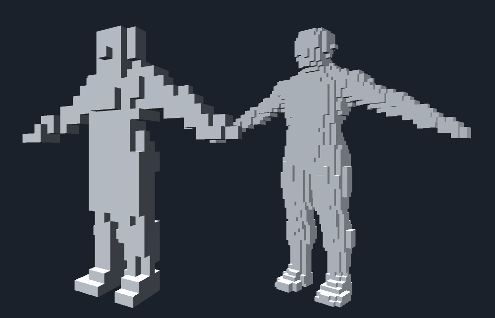
*Figure: Difference in voxel resolution*

> **Choosing Resolution**
>
> Resolution is a trade-off between quality and performance:
> - **Low resolution (16-32)**: Fast, chunky look, good for effects
> - **Medium resolution (64-128)**: Balanced, recognizable shapes
> - **High resolution (256+)**: Detailed but expensive, mainly for static content
>
> For real-time applications on animated meshes, you'll typically use lower resolutions.

### Step 2: Setting the Voxelization Range

Specify the range to voxelize the target mesh model. By using the mesh's **Bounding Box** (the smallest rectangular box containing all vertices) as the voxelization range, you can voxelize the entire mesh model.

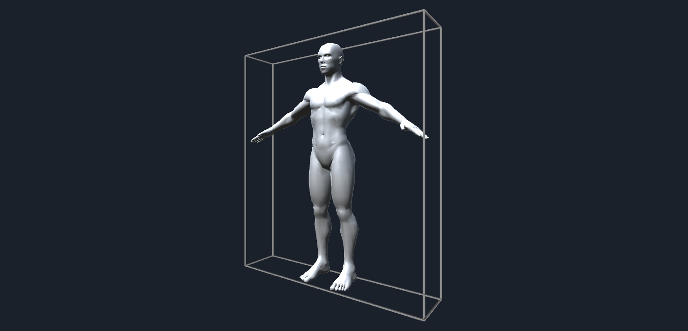
*Figure: Mesh Bounding Box*

One important consideration: if you use the mesh's bounding box directly as the voxelization range, problems occur when voxelizing meshes with faces that exactly align with the bounding box (like a Cube mesh).

As explained later, voxelization performs intersection tests between triangles and voxels. When a triangle face exactly aligns with a voxel face, intersection detection may not work correctly.

Therefore, we extend the mesh's bounding box by **half the voxel unit length** and use that as the voxelization range:

```csharp
mesh.RecalculateBounds();
var bounds = mesh.bounds;

// Calculate the unit length of a single voxel from the specified resolution
float maxLength = Mathf.Max(
    bounds.size.x,
    Mathf.Max(bounds.size.y, bounds.size.z)
);
unit = maxLength / resolution;

// Half the unit length
var hunit = unit * 0.5f;

// Use the range extended by "half the unit length" as the voxelization range

// Minimum value of the voxelization bounds
var start = bounds.min - new Vector3(hunit, hunit, hunit);

// Maximum value of the voxelization bounds
var end = bounds.max + new Vector3(hunit, hunit, hunit);

// Size of the voxelization bounds
var size = end - start;
```

### Step 3: Generating the 3D Array for Voxel Data

The sample code provides a `Voxel_t` structure to represent voxels:

```csharp
[StructLayout(LayoutKind.Sequential)]
public struct Voxel_t {
    public Vector3 position;   // Voxel position
    public uint fill;          // Flag indicating whether this voxel should be filled
    public uint front;         // Flag indicating if the intersecting triangle faces forward
    ...
}
```

We generate a 3D array of `Voxel_t` and store voxel data in it:

```csharp
// Determine the 3D voxel data size based on voxel unit length and voxelization range
var width = Mathf.CeilToInt(size.x / unit);
var height = Mathf.CeilToInt(size.y / unit);
var depth = Mathf.CeilToInt(size.z / unit);
var volume = new Voxel_t[width, height, depth];
```

Since subsequent processing references each voxel's position and size, we pre-generate an AABB array matching the 3D voxel data:

```csharp
var boxes = new Bounds[width, height, depth];
var voxelUnitSize = Vector3.one * unit;
for(int x = 0; x < width; x++)
{
    for(int y = 0; y < height; y++)
    {
        for(int z = 0; z < depth; z++)
        {
            var p = new Vector3(x, y, z) * unit + start;
            var aabb = new Bounds(p, voxelUnitSize);
            boxes[x, y, z] = aabb;
        }
    }
}
```

> **What is an AABB?**
>
> **AABB (Axis-Aligned Bounding Box)** refers to a rectangular bounding volume with edges parallel to the X, Y, and Z axes of 3D space.
>
> AABBs are commonly used for collision detection - for simplified collision checks between two meshes, or between a mesh and a ray.
>
> Performing exact collision detection against a mesh requires testing all triangles, but testing against just the containing AABB is much faster.
>
> 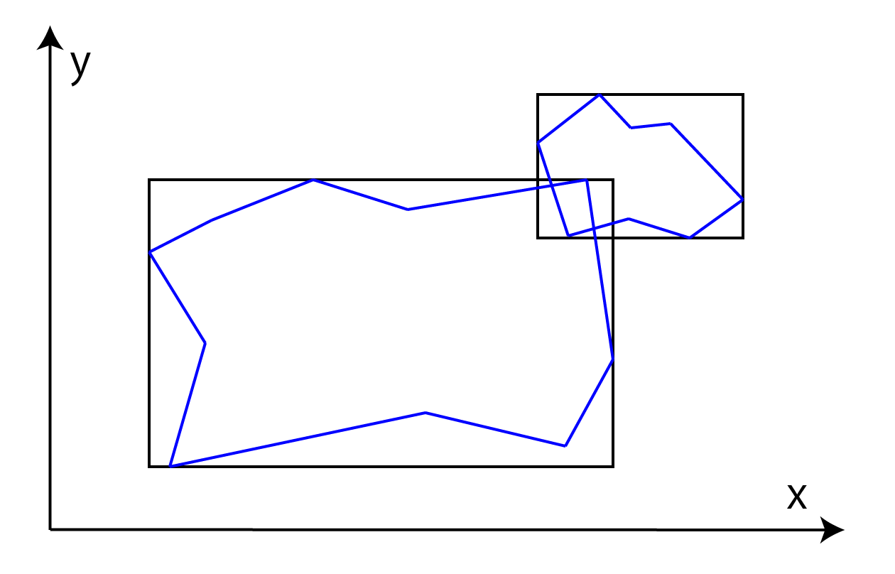
> *Figure: AABB collision detection between two polygon objects*

### Step 4: Generating Surface Voxels

As shown in the figure below, we first generate voxels located on the mesh surface:

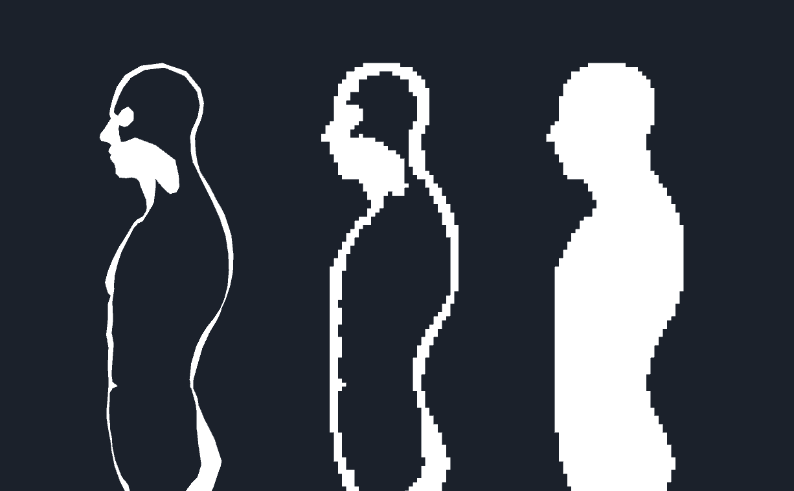
*Figure: First generate surface voxels, then use them to fill the interior*

To find voxels on the mesh surface, we need to perform intersection tests between each triangle composing the mesh and the voxels.

---

## Triangle-Voxel Intersection Testing (SAT Algorithm)

For triangle-voxel intersection testing, we use the **SAT (Separating Axis Theorem)**. The SAT-based intersection algorithm can be used generally for intersection testing between any convex shapes, not just triangles and voxels.

> **Understanding the Separating Axis Theorem**
>
> The SAT states: If you can find a line (in 2D) or plane (in 3D) that completely separates two convex objects, with all of object A on one side and all of object B on the other, then the objects do **not** intersect.
>
> This separating line/plane is always perpendicular to what's called a **separating axis**.
>
> The key insight: for convex shapes, you only need to test a **finite set of potential separating axes**. If none of them separate the objects, they must be intersecting!

Using SAT, if we can find an axis (separating axis) where the projections of two convex shapes don't overlap, then a separating line exists and we can conclude the shapes don't intersect. Conversely, if no separating axis is found, the two convex shapes are intersecting.

(Note: For concave shapes, even if no separating axis is found, the shapes might not be intersecting.)

When a convex shape is projected onto an axis, its shadow appears on that axis as a line segment, representable as a range interval [min, max].

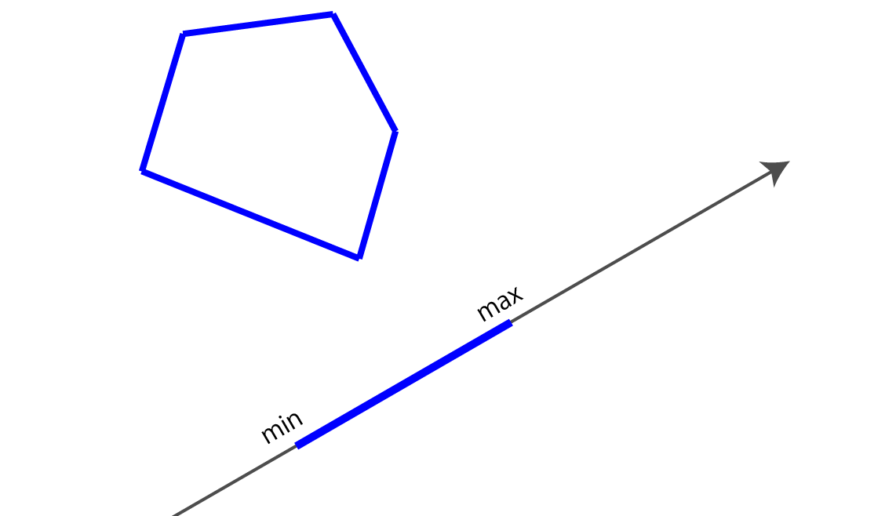
*Figure: Projecting a convex shape onto an axis, showing the projected range (min, max)*

As shown below, when a separating line exists between two convex shapes, the projection intervals onto the perpendicular separating axis don't overlap:

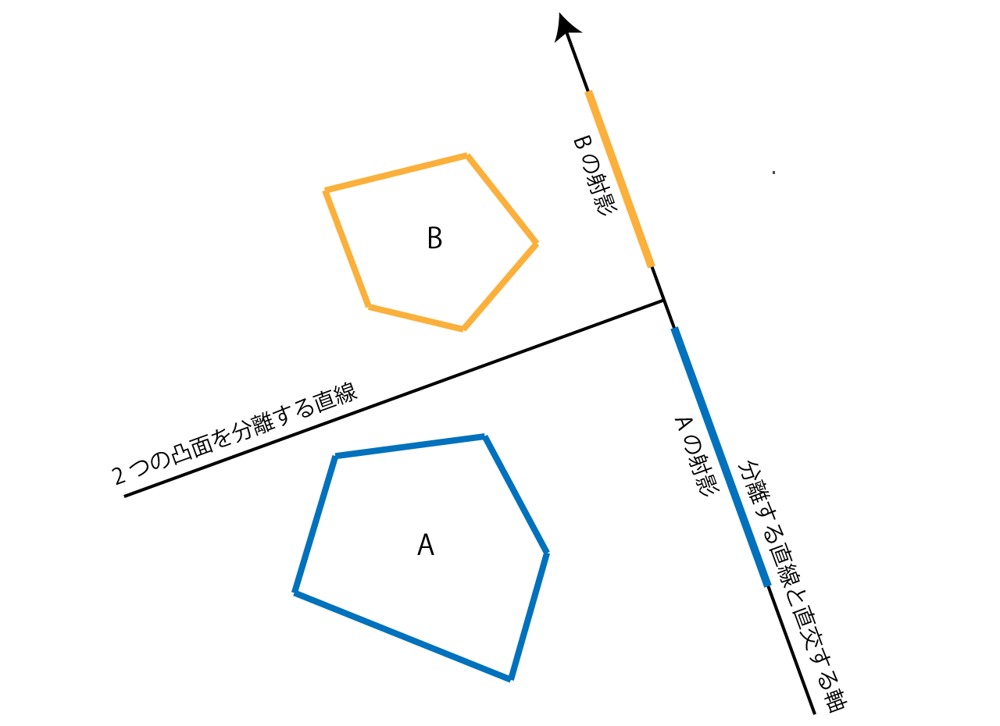
*Figure: When a separating line exists, projections onto the perpendicular axis don't overlap*

However, for the same two convex shapes, projections onto other (non-separating) axes may overlap:

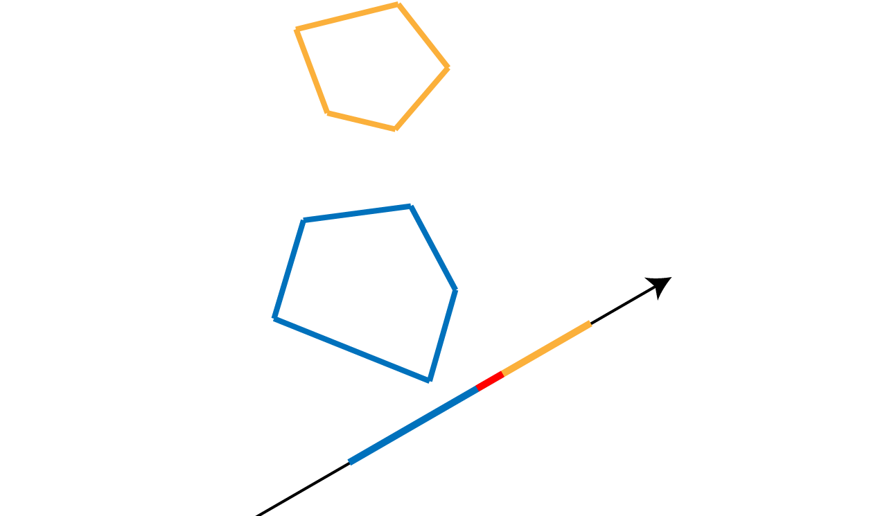
*Figure: Projections onto non-separating axes may overlap*

For certain shapes, the potential separating axes are well-defined. To test intersection between two such shapes A and B, project both shapes onto each potential separating axis and check if the projection intervals [Amin, Amax] and [Bmin, Bmax] overlap.

Mathematically: if `Amax < Bmin` or `Bmax < Amin`, the two intervals don't overlap.

> **The 13 Axes for Triangle-AABB Testing**
>
> For convex shapes, potential separating axes are:
> - Cross products of edges from shape 1 and shape 2
> - Face normals of shape 1
> - Face normals of shape 2
>
> For a triangle and an AABB, this gives us:
> - **9 axes**: Cross products of the triangle's 3 edges with the AABB's 3 edge directions
> - **3 axes**: The AABB's face normals (X, Y, Z axes)
> - **1 axis**: The triangle's face normal
>
> Total: **13 axes** to test

### Implementation: Triangle-AABB Intersection

Testing every triangle against every voxel would be wasteful. Instead, we compute the AABB of each triangle and only test against voxels that might intersect:

```csharp
// Calculate triangle's AABB
var min = tri.bounds.min - start;
var max = tri.bounds.max - start;
int iminX = Mathf.RoundToInt(min.x / unit);
int iminY = Mathf.RoundToInt(min.y / unit);
int iminZ = Mathf.RoundToInt(min.z / unit);
int imaxX = Mathf.RoundToInt(max.x / unit);
int imaxY = Mathf.RoundToInt(max.y / unit);
int imaxZ = Mathf.RoundToInt(max.z / unit);
iminX = Mathf.Clamp(iminX, 0, width - 1);
iminY = Mathf.Clamp(iminY, 0, height - 1);
iminZ = Mathf.Clamp(iminZ, 0, depth - 1);
imaxX = Mathf.Clamp(imaxX, 0, width - 1);
imaxY = Mathf.Clamp(imaxY, 0, height - 1);
imaxZ = Mathf.Clamp(imaxZ, 0, depth - 1);

// Test intersection within the triangle's AABB
for(int x = iminX; x <= imaxX; x++) {
    for(int y = iminY; y <= imaxY; y++) {
        for(int z = iminZ; z <= imaxZ; z++) {
            if(Intersects(tri, boxes[x, y, z])) {
                ...
            }
        }
    }
}
```

The `Intersects(Triangle, Bounds)` function performs the actual intersection test:

```csharp
public static bool Intersects(Triangle tri, Bounds aabb)
{
    ...
}
```

This function tests the 13 axes. Several optimizations are applied:
- The AABB's normals are known (they're simply the X, Y, Z axes)
- We translate coordinates so the AABB center is at the origin (0, 0, 0)

```csharp
// Get AABB center and half-extents
Vector3 center = aabb.center, extents = aabb.max - center;

// Translate triangle vertices so AABB center is at origin
Vector3 v0 = tri.a - center,
        v1 = tri.b - center,
        v2 = tri.c - center;

// Get vectors representing the triangle's three edges
Vector3 f0 = v1 - v0,
        f1 = v2 - v1,
        f2 = v0 - v2;
```

Since the AABB edges are parallel to the X, Y, Z axes, we can compute the 9 cross product axes without expensive calculations:

```csharp
// Since AABB edges have directions x(1,0,0), y(0,1,0), z(0,0,1),
// we can obtain the 9 cross products directly
Vector3
    a00 = new Vector3(0, -f0.z, f0.y), // X-axis cross f0
    a01 = new Vector3(0, -f1.z, f1.y), // X cross f1
    a02 = new Vector3(0, -f2.z, f2.y), // X cross f2
    a10 = new Vector3(f0.z, 0, -f0.x), // Y cross f0
    a11 = new Vector3(f1.z, 0, -f1.x), // Y cross f1
    a12 = new Vector3(f2.z, 0, -f2.x), // Y cross f2
    a20 = new Vector3(-f0.y, f0.x, 0), // Z cross f0
    a21 = new Vector3(-f1.y, f1.x, 0), // Z cross f1
    a22 = new Vector3(-f2.y, f2.x, 0); // Z cross f2

// Test all 9 axes (if any don't intersect, return false)
if (
    !Intersects(v0, v1, v2, extents, a00) ||
    !Intersects(v0, v1, v2, extents, a01) ||
    !Intersects(v0, v1, v2, extents, a02) ||
    !Intersects(v0, v1, v2, extents, a10) ||
    !Intersects(v0, v1, v2, extents, a11) ||
    !Intersects(v0, v1, v2, extents, a12) ||
    !Intersects(v0, v1, v2, extents, a20) ||
    !Intersects(v0, v1, v2, extents, a21) ||
    !Intersects(v0, v1, v2, extents, a22)
)
{
    return false;
}
```

The projection and overlap test for each axis:

```csharp
protected static bool Intersects(
    Vector3 v0,
    Vector3 v1,
    Vector3 v2,
    Vector3 extents,
    Vector3 axis
)
{
    ...
}
```

> **The AABB Projection Optimization**
>
> By centering the AABB at the origin, we get a powerful optimization. Instead of projecting all 8 AABB vertices onto the axis, we only need to project the extents (half-dimensions).
>
> The projected value `r` represents the interval [-r, r] on the axis. This means one projection calculation covers the entire AABB!

```csharp
// Project triangle vertices onto the axis
float p0 = Vector3.Dot(v0, axis);
float p1 = Vector3.Dot(v1, axis);
float p2 = Vector3.Dot(v2, axis);

// Project the AABB's maximum extent vertex onto the axis to get r
// The AABB interval is [-r, r], so we don't need to project all vertices
float r =
    extents.x * Mathf.Abs(axis.x) +
    extents.y * Mathf.Abs(axis.y) +
    extents.z * Mathf.Abs(axis.z);

// Triangle projection interval
float minP = Mathf.Min(p0, p1, p2);
float maxP = Mathf.Max(p0, p1, p2);

// Check if triangle and AABB intervals overlap
return !((maxP < -r) || (r < minP));
```

After testing the 9 cross-product axes, we test the AABB's 3 face normals. Since the AABB normals are parallel to the X, Y, Z axes and we've translated coordinates to center the AABB at the origin, we simply compare triangle vertex coordinates against extents:

```csharp
// X-axis
if (
    Mathf.Max(v0.x, v1.x, v2.x) < -extents.x ||
    Mathf.Min(v0.x, v1.x, v2.x) > extents.x
)
{
    return false;
}

// Y-axis
if (
    Mathf.Max(v0.y, v1.y, v2.y) < -extents.y ||
    Mathf.Min(v0.y, v1.y, v2.y) > extents.y
)
{
    return false;
}

// Z-axis
if (
    Mathf.Max(v0.z, v1.z, v2.z) < -extents.z ||
    Mathf.Min(v0.z, v1.z, v2.z) > extents.z
)
{
    return false;
}
```

Finally, we test the triangle's normal by checking plane-AABB intersection:

```csharp
var normal = Vector3.Cross(f1, f0).normalized;
var pl = new Plane(normal, Vector3.Dot(normal, tri.a));
return Intersects(pl, aabb);
```

The plane-AABB intersection test:

```csharp
public static bool Intersects(Plane pl, Bounds aabb)
{
    Vector3 center = aabb.center;
    var extents = aabb.max - center;

    // Project extents onto the plane normal
    var r =
        extents.x * Mathf.Abs(pl.normal.x) +
        extents.y * Mathf.Abs(pl.normal.y) +
        extents.z * Mathf.Abs(pl.normal.z);

    // Calculate distance from plane to AABB center
    var s = Vector3.Dot(pl.normal, center) - pl.distance;

    // Check if s is within [-r, r]
    return Mathf.Abs(s) <= r;
}
```

### Writing Intersecting Voxels to the Array

When we find a triangle intersecting a voxel, we set the voxel's `fill` flag and the `front` flag indicating whether the triangle faces forward or backward from a specified direction:

```csharp
if(Intersects(tri, boxes[x, y, z])) {
    // Get the voxel at position (x, y, z)
    var voxel = volume[x, y, z];

    // Set the voxel position
    voxel.position = boxes[x, y, z].center;

    if(voxel.fill & 1 == 0) {
        // If voxel isn't filled yet, set the front flag
        voxel.front = front;
    } else {
        // If voxel is already filled by another triangle,
        // prioritize back-facing
        voxel.front = voxel.front & front;
    }

    // Set the fill flag
    voxel.fill = 1;
    volume[x, y, z] = voxel;
}
```

When a voxel intersects both front-facing and back-facing triangles, we prioritize the back-facing flag.

The `front` flag is needed for the "fill interior" processing explained next. It indicates whether the triangle faces forward or backward from the "fill direction."

In the sample code, we fill the interior along the forward(0, 0, 1) direction, so we determine if triangles face forward from that direction:

```csharp
public class Triangle {
    public Vector3 a, b, c;     // Triangle's three vertices
    public bool frontFacing;    // Whether triangle faces the fill direction
    public Bounds bounds;       // Triangle's AABB

    public Triangle (Vector3 a, Vector3 b, Vector3 c, Vector3 dir) {
        this.a = a;
        this.b = b;
        this.c = c;

        // Determine if triangle faces forward from the fill direction
        var normal = Vector3.Cross(b - a, c - a);
        this.frontFacing = (Vector3.Dot(normal, dir) <= 0f);

        ...
    }
}
```

---

## Step 5: Filling Interior Voxels

Now that we have the surface voxel data, we fill the interior.

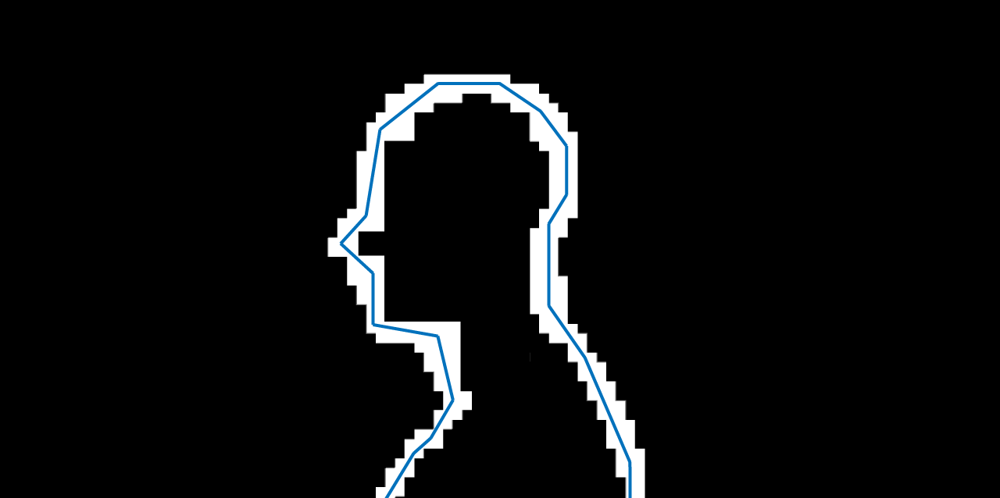
*Figure: State after generating surface voxels*

### The Fill Algorithm

We search for voxels facing forward from the fill direction.

Empty voxels are passed through:

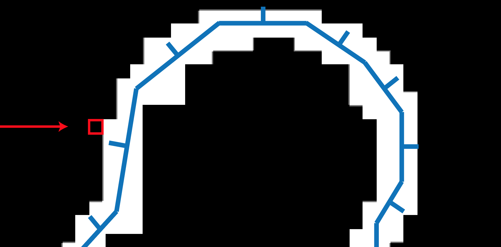
*Figure: Searching for front-facing voxels, passing through empty ones (arrow = fill direction, box = current position)*

When we find a front-facing voxel, we traverse through the front-facing voxels:

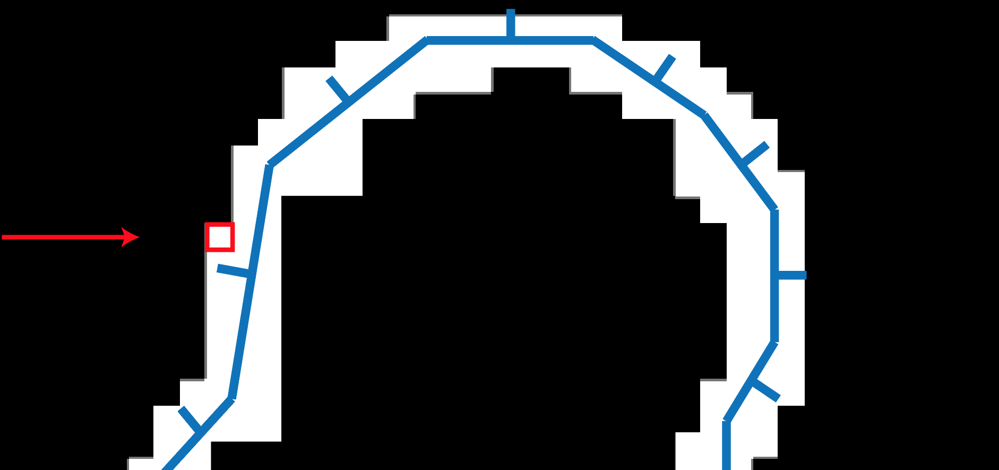
*Figure: Found a front-facing voxel (lines from mesh are normals - opposing the fill direction means front-facing)*

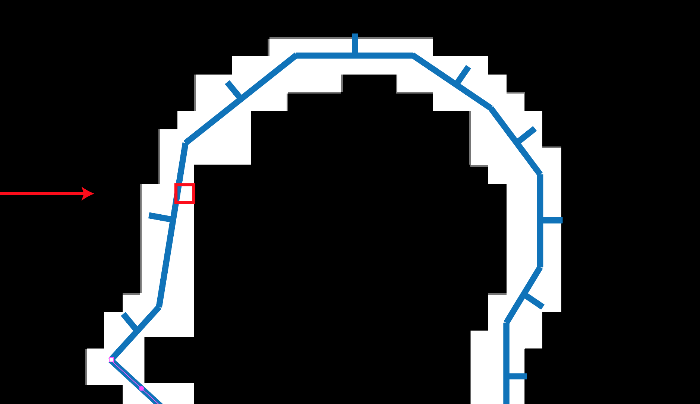
*Figure: Traversing through front-facing voxels*

After passing through the front-facing voxels, we reach the mesh interior:

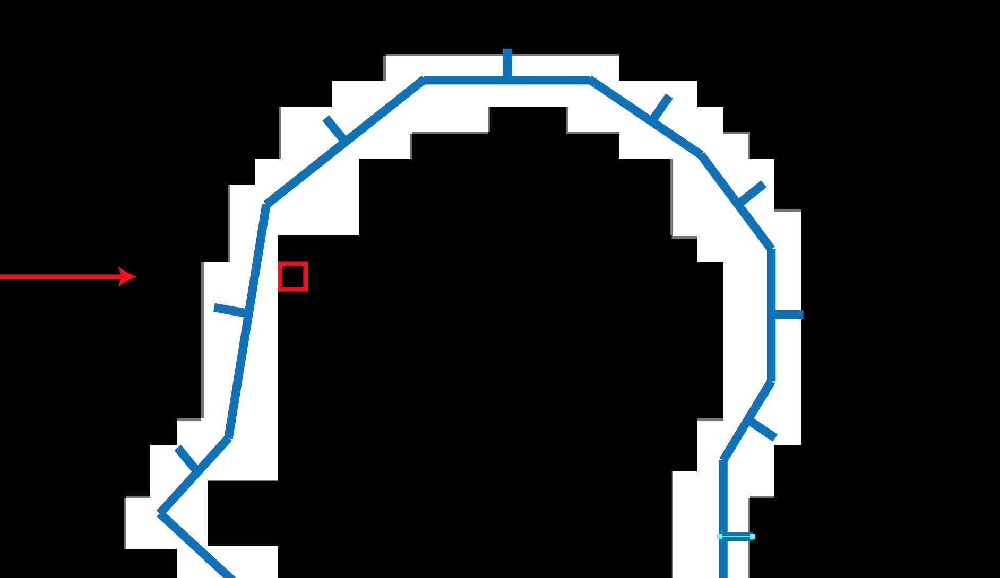
*Figure: Passed through front-facing voxels, reached mesh interior*

We proceed through the interior, filling each voxel we reach:

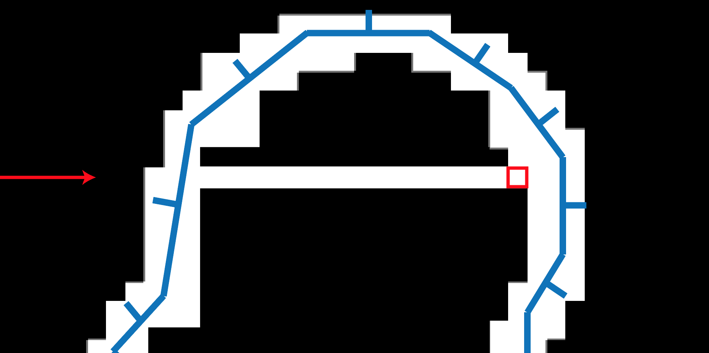
*Figure: Filling voxels as we traverse the interior*

When we reach a back-facing voxel, we've filled the entire interior. We traverse through the back-facing voxels and exit the mesh, then resume searching for front-facing voxels:

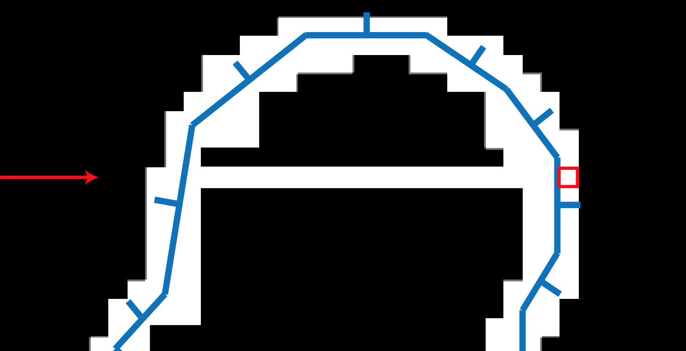
*Figure: Traversing back-facing voxels and exiting the mesh*

> **Understanding the Fill Logic**
>
> This is essentially a **ray marching** approach along the Z-axis:
> 1. **Outside mesh**: Empty voxels, keep searching
> 2. **Enter mesh**: Hit front-facing surface voxels
> 3. **Inside mesh**: Fill all voxels
> 4. **Exit mesh**: Hit back-facing surface voxels
> 5. **Outside mesh again**: Back to step 1
>
> By prioritizing back-facing flags on surface voxels, we ensure proper handling of thin geometry where front and back faces share the same voxel.

### Fill Implementation

Since we fill along the forward(0, 0, 1) direction, we iterate along the Z direction in the 3D voxel array:

```csharp
// Fill the mesh interior
for(int x = 0; x < width; x++)
{
    for(int y = 0; y < height; y++)
    {
        // Fill from front to back along Z
        for(int z = 0; z < depth; z++)
        {
            ...
        }
    }
}
```

Using the `front` flag stored in each voxel, we implement the fill process:

```csharp
...
// Fill from front to back along Z
for(int z = 0; z < depth; z++)
{
    // Skip if (x, y, z) is empty
    if (volume[x, y, z].IsEmpty()) continue;

    // Traverse front-facing voxels
    int ifront = z;
    for(; ifront < depth && volume[x, y, ifront].IsFrontFace(); ifront++) {}

    // Done if we reached the end
    if(ifront >= depth) break;

    // Search for back-facing voxels
    int iback = ifront;

    // Traverse through the interior
    for (; iback < depth && volume[x, y, iback].IsEmpty(); iback++) {}

    // Done if we reached the end
    if (iback >= depth) break;

    // Check if (x, y, iback) is back-facing
    if(volume[x, y, iback].IsBackFace()) {
        // Traverse back-facing voxels
        for (; iback < depth && volume[x, y, iback].IsBackFace(); iback++) {}
    }

    // Fill voxels from (x, y, ifront) to (x, y, iback)
    for(int z2 = ifront; z2 < iback; z2++)
    {
        var p = boxes[x, y, z2].center;
        var voxel = volume[x, y, z2];
        voxel.position = p;
        voxel.fill = 1;
        volume[x, y, z2] = voxel;
    }

    // Advance the loop to the processed position
    z = iback;
}
```

At this point, we have voxel data with the mesh interior filled.

The 3D voxel data contains empty voxels, so `CPUVoxelizer.Voxelize` returns only the voxels representing the surface and filled interior:

```csharp
// Get non-empty voxels
voxels = new List<Voxel_t>();
for(int x = 0; x < width; x++) {
    for(int y = 0; y < height; y++) {
        for(int z = 0; z < depth; z++) {
            if(!volume[x, y, z].IsEmpty())
            {
                voxels.Add(volume[x, y, z]);
            }
        }
    }
}
```

The `CPUVoxelizerTest.cs` script builds and visualizes a mesh using the voxel data from `CPUVoxelizer`.

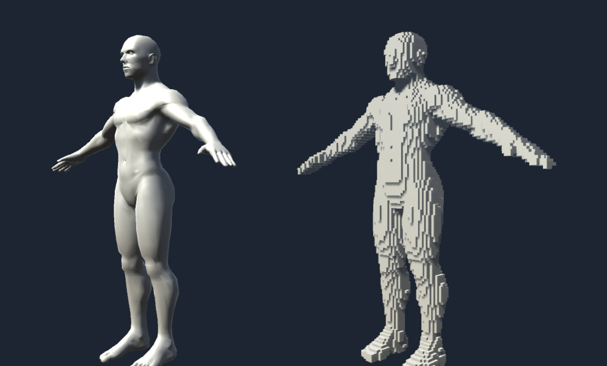
*Figure: Voxel data from CPUVoxelizer.Voxelize visualized as a mesh (CPUVoxelizerTest.scene)*

---

## Voxel Mesh Representation

The `VoxelMesh` class contains processing to build a mesh from the `Voxel_t[]` array and voxel unit size information.

The `CPUVoxelizerTest.cs` from the previous section uses this class to generate voxel meshes:

```csharp
public class VoxelMesh {

    public static Mesh Build (Voxel_t[] voxels, float size)
    {
        var hsize = size * 0.5f;
        var forward = Vector3.forward * hsize;
        var back = -forward;
        var up = Vector3.up * hsize;
        var down = -up;
        var right = Vector3.right * hsize;
        var left = -right;

        var vertices = new List<Vector3>();
        var normals = new List<Vector3>();
        var triangles = new List<int>();

        for(int i = 0, n = voxels.Length; i < n; i++)
        {
            if(voxel[i].fill == 0) continue;

            var p = voxels[i].position;

            // 8 corner vertices forming a cube for one voxel
            var corners = new Vector3[8] {
                p + forward + left + up,
                p + back + left + up,
                p + back + right + up,
                p + forward + right + up,

                p + forward + left + down,
                p + back + left + down,
                p + back + right + down,
                p + forward + right + down,
            };

            // Build the 6 faces of the cube
            // (up, down, right, left, forward, back faces)
            ...
        }

        var mesh = new Mesh();
        mesh.SetVertices(vertices);

        // Use 32-bit index format if vertex count exceeds 16-bit support
        mesh.indexFormat =
            (vertices.Count <= 65535)
            ? IndexFormat.UInt16 : IndexFormat.UInt32;
        mesh.SetNormals(normals);
        mesh.SetIndices(triangles.ToArray(), MeshTopology.Triangles, 0);
        mesh.RecalculateBounds();
        return mesh;
    }
}
```

---

## GPU Implementation

Now we'll explain how to perform the voxelization implemented in `CPUVoxelizer` much faster using the GPU.

The voxelization algorithm from `CPUVoxelizer` can be parallelized across each coordinate in a grid on the XY plane, divided by the voxel unit length.

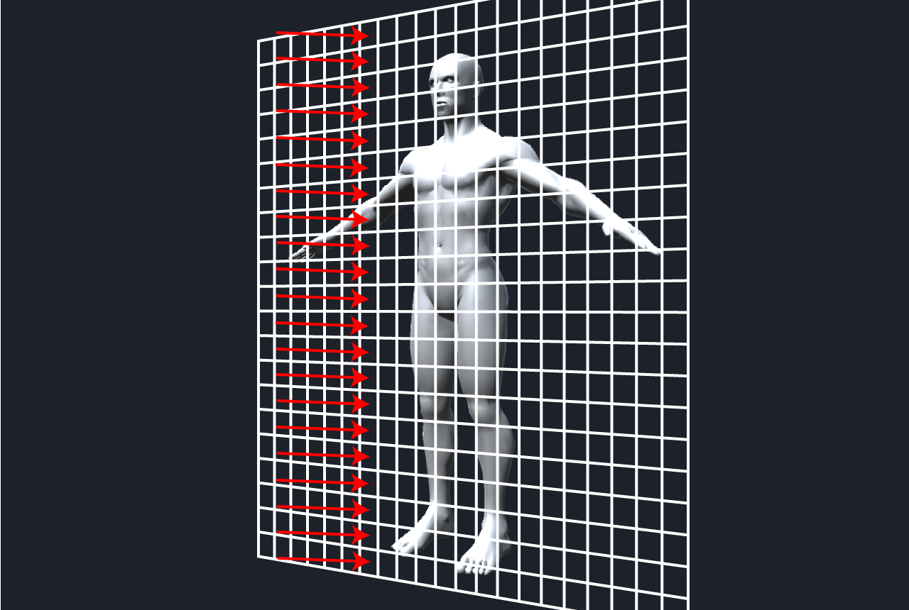
*Figure: Grid on XY plane divided by voxel unit length - voxelization can be parallelized per grid cell for GPU implementation*

By assigning each parallelizable operation to a GPU thread, we can benefit from the GPU's high-speed parallel computation.

The GPU voxelization implementation is in `GPUVoxelizer.cs` and `Voxelizer.compute`.

> **Prerequisites**
>
> This section uses **Compute Shaders** for GPGPU programming. If you're unfamiliar with Compute Shaders, please refer to Unity Graphics Programming Volume 1, "Introduction to Compute Shaders" for the basics.

GPU voxelization is executed by calling the static function:

```csharp
public class GPUVoxelizer
{
    public static GPUVoxelData Voxelize (
        ComputeShader voxelizer,
        Mesh mesh,
        int resolution
    ) {
    ...
    }
}
```

Specify `Voxelizer.compute`, the mesh to voxelize, and the resolution. The function returns `GPUVoxelData` containing the voxel data.

### GPU Voxelization Data Setup

We perform the same setup as the CPU implementation (steps 1-3):

```csharp
public static GPUVoxelData Voxelize (
    ComputeShader voxelizer,
    Mesh mesh,
    int resolution
) {
    // Same processing as CPUVoxelizer.Voxelize -------
    mesh.RecalculateBounds();
    var bounds = mesh.bounds;

    float maxLength = Mathf.Max(
        bounds.size.x,
        Mathf.Max(bounds.size.y, bounds.size.z)
    );
    var unit = maxLength / resolution;

    var hunit = unit * 0.5f;

    var start = bounds.min - new Vector3(hunit, hunit, hunit);
    var end = bounds.max + new Vector3(hunit, hunit, hunit);
    var size = end - start;

    int width = Mathf.CeilToInt(size.x / unit);
    int height = Mathf.CeilToInt(size.y / unit);
    int depth = Mathf.CeilToInt(size.z / unit);
    // ------- End same as CPUVoxelizer.Voxelize
    ...
}
```

The `Voxel_t` array is defined as a `ComputeBuffer` for GPU access. Note that unlike the CPU's 3D array, we define it as a **1D array**.

> **Why a 1D Array?**
>
> GPUs don't handle multidimensional arrays well. Instead, we use a 1D array and calculate the index from 3D coordinates (x, y, z) within the Compute Shader, effectively treating the 1D array as a 3D array.
>
> The index formula is typically: `index = x + y * width + z * width * height`

```csharp
// Create ComputeBuffer for Voxel_t array
var voxelBuffer = new ComputeBuffer(
    width * height * depth,
    Marshal.SizeOf(typeof(Voxel_t))
);
var voxels = new Voxel_t[voxelBuffer.count];
voxelBuffer.SetData(voxels); // Initialize
```

Transfer the setup data to the GPU:

```csharp
// Transfer voxel data to GPU
voxelizer.SetVector("_Start", start);
voxelizer.SetVector("_End", end);
voxelizer.SetVector("_Size", size);

voxelizer.SetFloat("_Unit", unit);
voxelizer.SetFloat("_InvUnit", 1f / unit);
voxelizer.SetFloat("_HalfUnit", hunit);
voxelizer.SetInt("_Width", width);
voxelizer.SetInt("_Height", height);
voxelizer.SetInt("_Depth", depth);
```

Create `ComputeBuffer`s for the mesh data (needed for triangle-voxel intersection testing):

```csharp
// Create ComputeBuffer for mesh vertex array
var vertices = mesh.vertices;
var vertBuffer = new ComputeBuffer(
    vertices.Length,
    Marshal.SizeOf(typeof(Vector3))
);
vertBuffer.SetData(vertices);

// Create ComputeBuffer for mesh triangle array
var triangles = mesh.triangles;
var triBuffer = new ComputeBuffer(
    triangles.Length,
    Marshal.SizeOf(typeof(int))
);
triBuffer.SetData(triangles);
```

### GPU Surface Voxel Generation

When generating surface voxels on the GPU, we first process front-facing triangles, then back-facing triangles.

> **Why Process Front and Back Separately?**
>
> With GPU parallel computation, multiple threads might write to the same voxel simultaneously, leading to **race conditions** and undefined results.
>
> Since we want to prioritize back-facing flags, we process front-facing triangles first, then back-facing. This ensures back-facing values overwrite front-facing ones, eliminating result ambiguity.

Transfer mesh data to the `SurfaceFront` kernel:

```csharp
// Transfer mesh data to SurfaceFront kernel
var surfaceFrontKer = new Kernel(voxelizer, "SurfaceFront");
voxelizer.SetBuffer(surfaceFrontKer.Index, "_VoxelBuffer", voxelBuffer);
voxelizer.SetBuffer(surfaceFrontKer.Index, "_VertBuffer", vertBuffer);
voxelizer.SetBuffer(surfaceFrontKer.Index, "_TriBuffer", triBuffer);

// Set triangle count
var triangleCount = triBuffer.count / 3; // (vertex indices / 3) = triangle count
voxelizer.SetInt("_TriangleCount", triangleCount);
```

This process runs in parallel per triangle. Set thread groups to `(triangleCount / threads + 1, 1, 1)`:

```csharp
// Build voxels intersecting front-facing triangles
voxelizer.Dispatch(
    surfaceFrontKer.Index,
    triangleCount / (int)surfaceFrontKer.ThreadX + 1,
    (int)surfaceFrontKer.ThreadY,
    (int)surfaceFrontKer.ThreadZ
);
```

The `SurfaceFront` kernel processes only front-facing triangles, returning early for back-facing ones:

```hlsl
[numthreads(8, 1, 1)]
void SurfaceFront (uint3 id : SV_DispatchThreadID)
{
    // Return if exceeding triangle count
    int idx = (int)id.x;
    if(idx >= _TriangleCount) return;

    // Get triangle vertex positions and front/back flag
    float3 va, vb, vc;
    bool front;
    get_triangle(idx, va, vb, vc, front);

    // Return if back-facing
    if (!front) return;

    // Build surface voxels
    surface(va, vb, vc, front);
}
```

The `get_triangle` function retrieves triangle vertices and front/back flag from mesh data:

```hlsl
void get_triangle(
    int idx,
    out float3 va, out float3 vb, out float3 vc,
    out bool front
)
{
    int ia = _TriBuffer[idx * 3];
    int ib = _TriBuffer[idx * 3 + 1];
    int ic = _TriBuffer[idx * 3 + 2];

    va = _VertBuffer[ia];
    vb = _VertBuffer[ib];
    vc = _VertBuffer[ic];

    // Determine if triangle is front or back-facing from forward(0,0,1)
    float3 normal = cross((vb - va), (vc - vb));
    front = dot(normal, float3(0, 0, 1)) < 0;
}
```

The `surface` function performs intersection testing and writes to voxel data - nearly identical to the CPU implementation, with the addition of 1D index calculation:

```hlsl
void surface (float3 va, float3 vb, float3 vc, bool front)
{
    // Calculate triangle AABB
    float3 tbmin = min(min(va, vb), vc);
    float3 tbmax = max(max(va, vb), vc);

    float3 bmin = tbmin - _Start;
    float3 bmax = tbmax - _Start;
    int iminX = round(bmin.x / _Unit);
    int iminY = round(bmin.y / _Unit);
    int iminZ = round(bmin.z / _Unit);
    int imaxX = round(bmax.x / _Unit);
    int imaxY = round(bmax.y / _Unit);
    int imaxZ = round(bmax.z / _Unit);
    iminX = clamp(iminX, 0, _Width - 1);
    iminY = clamp(iminY, 0, _Height - 1);
    iminZ = clamp(iminZ, 0, _Depth - 1);
    imaxX = clamp(imaxX, 0, _Width - 1);
    imaxY = clamp(imaxY, 0, _Height - 1);
    imaxZ = clamp(imaxZ, 0, _Depth - 1);

    // Test intersection within triangle AABB
    for(int x = iminX; x <= imaxX; x++) {
        for(int y = iminY; y <= imaxY; y++) {
            for(int z = iminZ; z <= imaxZ; z++) {
                // Generate AABB for voxel at (x, y, z)
                float3 center = float3(x, y, z) * _Unit + _Start;
                AABB aabb;
                aabb.min = center - _HalfUnit;
                aabb.center = center;
                aabb.max = center + _HalfUnit;
                if(intersects_tri_aabb(va, vb, vc, aabb))
                {
                    // Get 1D index from (x, y, z)
                    uint vid = get_voxel_index(x, y, z);
                    Voxel voxel = _VoxelBuffer[vid];
                    voxel.position = get_voxel_position(x, y, z);
                    voxel.front = front;
                    voxel.fill = true;
                    _VoxelBuffer[vid] = voxel;
                }
            }
        }
    }
}
```

After processing front-facing triangles, process back-facing ones:

```csharp
var surfaceBackKer = new Kernel(voxelizer, "SurfaceBack");
voxelizer.SetBuffer(surfaceBackKer.Index, "_VoxelBuffer", voxelBuffer);
voxelizer.SetBuffer(surfaceBackKer.Index, "_VertBuffer", vertBuffer);
voxelizer.SetBuffer(surfaceBackKer.Index, "_TriBuffer", triBuffer);
voxelizer.Dispatch(
    surfaceBackKer.Index,
    triangleCount / (int)surfaceBackKer.ThreadX + 1,
    (int)surfaceBackKer.ThreadY,
    (int)surfaceBackKer.ThreadZ
);
```

`SurfaceBack` is identical to `SurfaceFront` except it returns early for front-facing triangles. Running `SurfaceBack` after `SurfaceFront` ensures that voxels intersecting both front and back-facing triangles will have their `front` flag overwritten to back-facing:

```hlsl
[numthreads(8, 1, 1)]
void SurfaceBack (uint3 id : SV_DispatchThreadID)
{
    int idx = (int)id.x;
    if(idx >= _TriangleCount) return;

    float3 va, vb, vc;
    bool front;
    get_triangle(idx, va, vb, vc, front);

    // Return if front-facing
    if (front) return;

    surface(va, vb, vc, front);
}
```

### GPU Interior Fill

The `Volume` kernel handles interior filling. It creates a thread for each coordinate on the XY grid - parallelizing the XY double loop from the CPU implementation:

```csharp
// Transfer voxel data to Volume kernel
var volumeKer = new Kernel(voxelizer, "Volume");
voxelizer.SetBuffer(volumeKer.Index, "_VoxelBuffer", voxelBuffer);

// Fill mesh interior
voxelizer.Dispatch(
    volumeKer.Index,
    width / (int)volumeKer.ThreadX + 1,
    height / (int)volumeKer.ThreadY + 1,
    (int)volumeKer.ThreadZ
);
```

The `Volume` kernel implementation is nearly identical to the CPU version:

```hlsl
[numthreads(8, 8, 1)]
void Volume (uint3 id : SV_DispatchThreadID)
{
    int x = (int)id.x;
    int y = (int)id.y;
    if(x >= _Width) return;
    if(y >= _Height) return;

    for (int z = 0; z < _Depth; z++)
    {
        Voxel voxel = _VoxelBuffer[get_voxel_index(x, y, z)];
        // Nearly identical processing to CPUVoxelizer.Voxelize follows
        ...
    }
}
```

After obtaining the voxel data, we release the mesh data buffers and create `GPUVoxelData`:

```csharp
// Release mesh data no longer needed
vertBuffer.Release();
triBuffer.Release();

return new GPUVoxelData(voxelBuffer, width, height, depth, unit);
```

GPU voxelization is now complete. `GPUVoxelizerTest.cs` demonstrates visualizing `GPUVoxelData`.

---

## CPU vs GPU Performance Comparison

The test scenes execute the Voxelizer at Play time, making the speed difference less obvious, but GPU implementation achieves significant speedup.

Performance depends heavily on the execution environment, mesh polygon count, and voxelization resolution, but under these conditions:

- **Environment**: Windows 10, Core i7 CPU, 32GB RAM, GeForce GTX 980 GPU
- **Mesh**: 5,319 vertices, 9,761 triangles
- **Resolution**: 256

The GPU implementation runs **over 50 times faster** than the CPU implementation.

> **Why Such a Big Difference?**
>
> The CPU processes XY grid positions sequentially (nested loops). With resolution 256, that's 256 x 256 = 65,536 sequential iterations.
>
> The GPU processes all 65,536 positions **simultaneously** across thousands of parallel threads. Each thread handles one Z-column independently.
>
> Additionally, the triangle intersection tests are parallelized per-triangle on the GPU, whereas the CPU must test triangles sequentially.

---

## Application Example: GPU Particle System

Let's introduce an application using the GPU-based Particle System: **GPUVoxelParticleSystem**.

`GPUVoxelParticleSystem` uses the `ComputeBuffer` from `GPUVoxelizer` in a Compute Shader for particle position calculations:

1. Voxelize an animated model every frame using `GPUVoxelizer`
2. Pass `GPUVoxelData`'s `ComputeBuffer` to the particle position Compute Shader
3. Render particles using GPU instancing

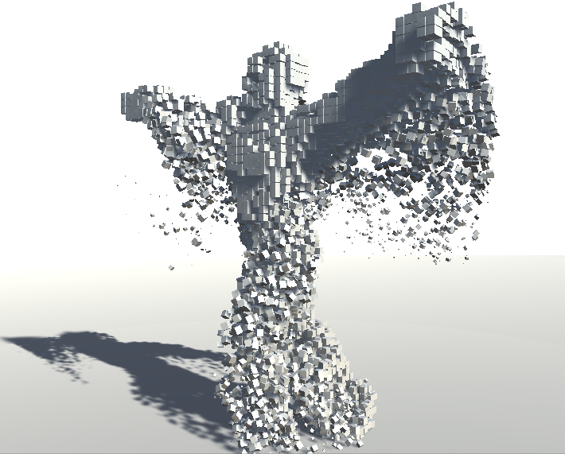
*Figure: Application using GPU Particle System (GPUVoxelParticleSystem)*

By spawning large numbers of particles from voxel positions, we achieve a visual of an animated model composed of particles.

Being able to voxelize animated models every frame is only possible thanks to GPU acceleration. Such high-speed GPU processing is essential for expanding the range of real-time visual expressions.

> **Real-Time Possibilities**
>
> With GPU voxelization, you can:
> - **Particle effects**: Characters dissolving into particles, reform from particles
> - **Destruction**: Convert mesh to voxels, then simulate debris
> - **Volume effects**: Sample voxels for volumetric fog that conforms to character shapes
> - **Physics**: Use voxels for simplified collision detection with thousands of objects
>
> The key is that you can update the voxel data every frame as the mesh animates!

---

## Summary

In this chapter, we introduced the mesh voxelization algorithm using a CPU implementation, then accelerated it with a GPU implementation.

We used an approach based on triangle-voxel intersection testing. An alternative approach exists: rendering the model from XYZ directions into a 3D texture using orthographic projection.

The method presented here has challenges with texture mapping on voxelized models, but the 3D texture rendering approach might achieve coloring more easily and accurately.

---

## Key Takeaways

> **What You Should Remember**
>
> 1. **Voxels are 3D pixels** - basic units in a regular 3D grid, useful for volumetric data and effects
>
> 2. **SAT (Separating Axis Theorem)** is a general algorithm for convex shape intersection testing
>    - For triangle-AABB: test 13 potential separating axes
>    - Early exit when any axis separates the shapes
>
> 3. **Voxelization has two phases:**
>    - Generate surface voxels (triangle-box intersection)
>    - Fill interior voxels (ray-march along one axis)
>
> 4. **GPU parallelization strategy:**
>    - Surface generation: parallelize per triangle
>    - Interior fill: parallelize per XY grid cell
>    - Handle race conditions by processing front/back faces separately
>
> 5. **Performance gains are dramatic** - 50x+ speedup enables real-time voxelization of animated meshes
>
> 6. **Practical applications:**
>    - Particle effects driven by mesh shape
>    - Dynamic destruction systems
>    - Volumetric rendering
>    - Collision detection optimization

---

## References

- http://blog.wolfire.com/2009/11/Triangle-mesh-voxelization
- http://www.dyn4j.org/2010/01/sat/
- https://gdbooks.gitbooks.io/3dcollisions/content/Chapter4/aabb-triangle.html
- Game Engine Architecture, 2nd Edition, Chapter 12
- https://developer.nvidia.com/content/basics-gpu-voxelization

---

*Next chapter: Explore more GPU graphics programming techniques in Unity Graphics Programming Volume 2!*
