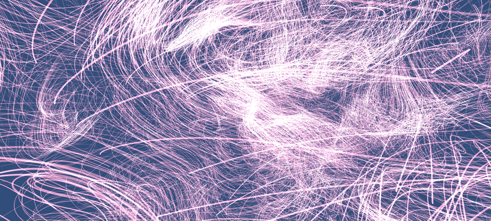
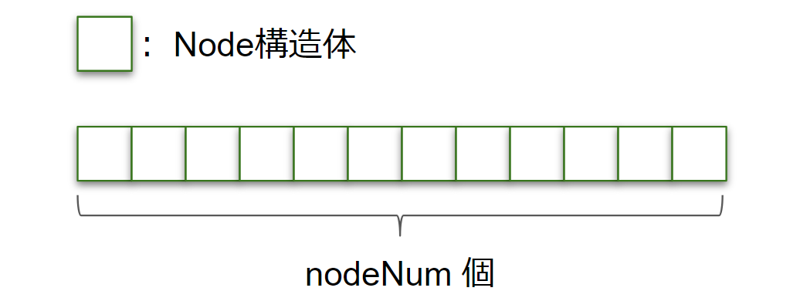
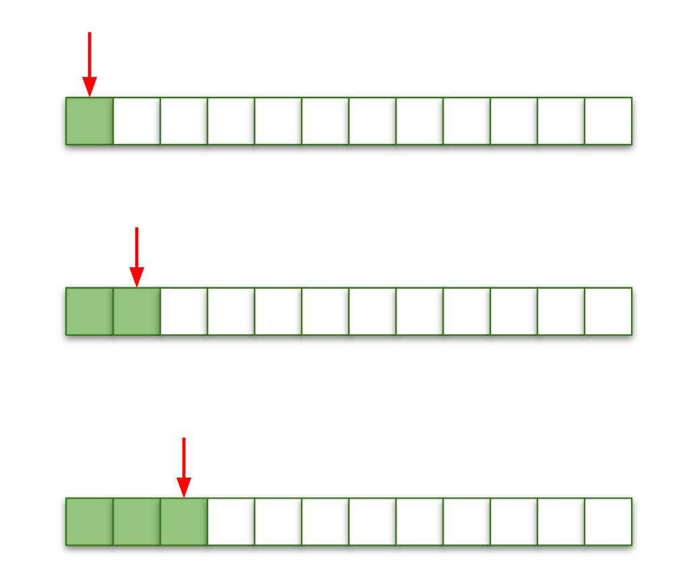
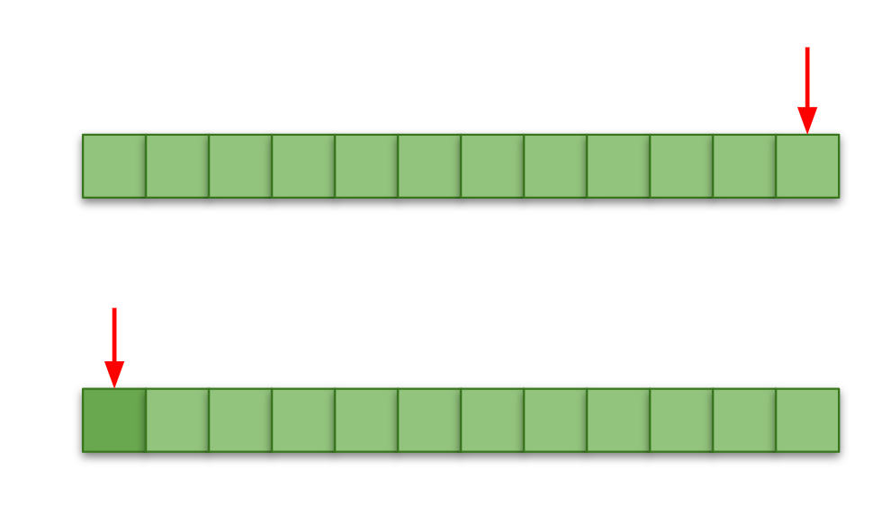
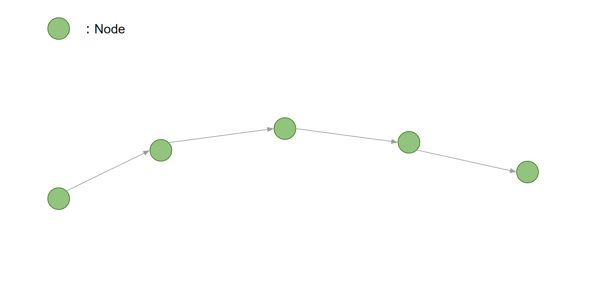
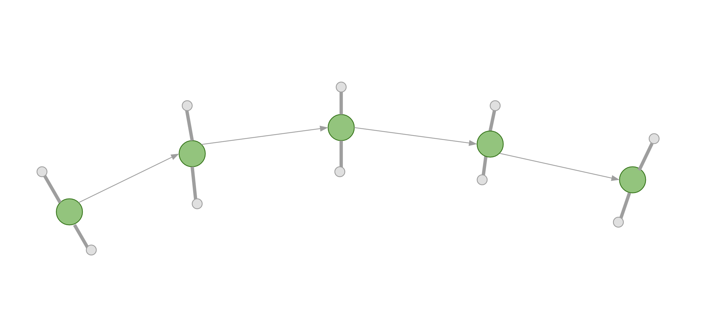
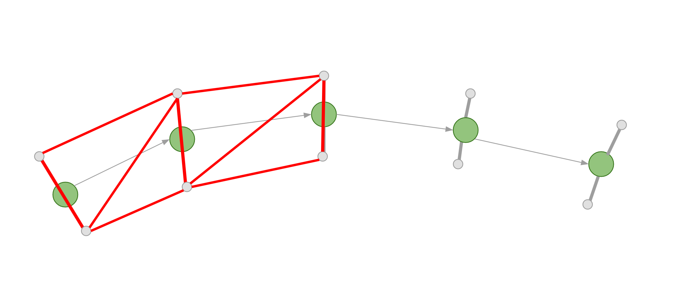

# Chapter 2: GPU-Based Trail

*Original author: @fuqunaga*
*Translation and annotations by Claude*

---

## Introduction

This chapter introduces how to create **Trails** (trajectories) using the GPU. The sample code for this chapter is "GPUBasedTrail" at: https://github.com/IndieVisualLab/UnityGraphicsProgramming2

### What is a Trail?

We call the trajectory of a moving object a **Trail**. In a broad sense, this includes car tire tracks, ship wakes, and ski tracks in snow. However, in computer graphics, the most impressive trails are probably curved light effects like car taillights or homing lasers in shooting games.

> **What Makes Trails Special in CG**
>
> Trails create a sense of motion and history. A single particle shows where something *is*; a trail shows where it *has been*. This temporal dimension adds drama and visual interest to any moving object.

### Unity's Built-in Trail Systems

Unity provides two built-in trail types:

- **TrailRenderer** - Used to draw the trajectory of a GameObject
- **Trails module** - Used to draw particle trajectories in the Particle System

Reference links:
- TrailRenderer: https://docs.unity3d.com/ja/current/Manual/class-TrailRenderer.html
- Trails module: https://docs.unity3d.com/Manual/PartSysTrailsModule.html

In this chapter, we intentionally avoid using these built-in features to focus on understanding how trails work internally. By implementing on the GPU, we can achieve greater quantity than even the Trails module allows.


*Sample code execution showing 10,000 trails*

> **Why Build Our Own?**
>
> Unity's built-in trails work great for typical use cases. But when you need:
> - **Massive quantity** (10,000+ trails)
> - **Custom behavior** (tentacles, ribbons, custom shading)
> - **Full GPU control** (no CPU-GPU data transfer)
>
> ...then building your own GPU-based system is the way to go.

---

## Creating the Data

Let's start building our trail system.

### Data Structure Definitions

We use three main structures:

```csharp
// GPUTrails.cs
public struct Trail
{
    public int currentNodeIdx;
}
```

The `Trail` structure corresponds to a single trail. `currentNodeIdx` stores the index of the most recently written node in the node buffer.

```csharp
// GPUTrails.cs
public struct Node
{
    public float time;
    public Vector3 pos;
}
```

The `Node` structure represents a control point within a trail. It stores the node's position and the time it was updated.

```csharp
// GPUTrails.cs
public struct Input
{
    public Vector3 pos;
}
```

The `Input` structure holds one frame's worth of input from an emitter (the object leaving the trail). Here it's just position, but you could add color or other properties for interesting effects.

> **Understanding the Three Structures**
>
> | Structure | Purpose | One per... |
> |-----------|---------|------------|
> | `Trail` | Bookkeeping for one trail | Trail |
> | `Node` | One point along a trail's path | Trail segment |
> | `Input` | Current emitter position | Frame per trail |
>
> Think of it this way: an `Input` comes in each frame, gets converted to a `Node`, and the `Trail` keeps track of all its nodes.

### Initialization

In `GPUTrails.Start()`, we initialize the buffers:

```csharp
// GPUTrails.cs
trailBuffer = new ComputeBuffer(trailNum, Marshal.SizeOf(typeof(Trail)));
nodeBuffer = new ComputeBuffer(totalNodeNum, Marshal.SizeOf(typeof(Node)));
inputBuffer = new ComputeBuffer(trailNum, Marshal.SizeOf(typeof(Input)));
```

We initialize `trailBuffer` with `trailNum` elements. This means our program handles multiple trails together in batch.

The `nodeBuffer` handles all nodes for all trails in a single buffer. Indices 0 through `nodeNum-1` belong to trail 0, `nodeNum` through `2*nodeNum-1` belong to trail 1, and so on.

The `inputBuffer` also holds `trailNum` elements, managing input for all trails.

> **Memory Layout Visualization**
>
> ```
> nodeBuffer (if nodeNum=4, trailNum=3):
>
> [Node0][Node1][Node2][Node3] | [Node0][Node1][Node2][Node3] | [Node0][Node1][Node2][Node3]
> |<----- Trail 0 ----->|     |<----- Trail 1 ----->|        |<----- Trail 2 ----->|
> ```
>
> Each trail gets its own contiguous section of the node buffer.

```csharp
// GPUTrails.cs
var initTrail = new Trail() { currentNodeIdx = -1 };
var initNode = new Node() { time = -1 };

trailBuffer.SetData(Enumerable.Repeat(initTrail, trailNum).ToArray());
nodeBuffer.SetData(Enumerable.Repeat(initNode, totalNodeNum).ToArray());
```

We set initial values for each buffer. By setting `Trail.currentNodeIdx` and `Node.time` to negative values, we can later use these to determine if they're unused.

The `inputBuffer` doesn't need initialization since it will be completely written to on the first update.

### Node Buffer Usage: The Ring Buffer

Here's how the node buffer is used:

#### Initial State


*Nothing has been input yet*

#### During Input


*Nodes are added one by one. Some nodes are still unused.*

#### Loop (Ring Buffer)


*When all nodes are used up, we wrap around and overwrite from the beginning. This is a ring buffer.*

> **Why a Ring Buffer?**
>
> A ring buffer is perfect for trails because:
> 1. **Fixed memory** - No allocations during runtime
> 2. **Automatic aging** - Old nodes naturally get overwritten
> 3. **Constant performance** - Same work regardless of trail length
>
> The oldest part of the trail disappears as new positions are added, creating the illusion of a trail that follows the emitter.

---

## Input Processing

From here, we're dealing with per-frame processing. We input emitter positions and add/update nodes.

First, `inputBuffer` is updated externally. This can be done however you like. The simplest approach might be calculating on the CPU and using `ComputeBuffer.SetData()`. In the sample code, we run a simple GPU-based particle system and use those particles as emitters.

> **Column: Curl Noise**
>
> The sample code's particles move by calculating forces from Curl Noise. Curl Noise is very convenient because it can easily create pseudo-fluid-like movement. See the chapter by @sakope in this book for a detailed explanation.

### Emitter Update

```csharp
// GPUTrailParticles.cs
void Update()
{
    cs.SetInt(CSPARAM.PARTICLE_NUM, particleNum);
    cs.SetFloat(CSPARAM.TIME, Time.time);
    cs.SetFloat(CSPARAM.TIME_SCALE, _timeScale);
    cs.SetFloat(CSPARAM.POSITION_SCALE, _positionScale);
    cs.SetFloat(CSPARAM.NOISE_SCALE, _noiseScale);

    var kernelUpdate = cs.FindKernel(CSPARAM.UPDATE);
    cs.SetBuffer(kernelUpdate, CSPARAM.PARTICLE_BUFFER_WRITE, _particleBuffer);

    var updateThureadNum = new Vector3(particleNum, 1f, 1f);
    ComputeShaderUtil.Dispatch(cs, kernelUpdate, updateThureadNum);


    var kernelInput = cs.FindKernel(CSPARAM.WRITE_TO_INPUT);
    cs.SetBuffer(kernelInput, CSPARAM.PARTICLE_BUFFER_READ, _particleBuffer);
    cs.SetBuffer(kernelInput, CSPARAM.INPUT_BUFFER, trails.inputBuffer);

    var inputThreadNum = new Vector3(particleNum, 1f, 1f);
    ComputeShaderUtil.Dispatch(cs, kernelInput, inputThreadNum);
}
```

Two kernels are executed:

- **CSPARAM.UPDATE**: Updates the particles used as emitters
- **CSPARAM.WRITE_TO_INPUT**: Writes the current emitter positions to `inputBuffer`. This is used as input to the trails.

### Trail Input Processing

Now let's reference `inputBuffer` and update `nodeBuffer`:

```csharp
// GPUTrailParticles.cs
void LateUpdate()
{
    cs.SetFloat(CSPARAM.TIME, Time.time);
    cs.SetFloat(CSPARAM.UPDATE_DISTANCE_MIN, updateDistaceMin);
    cs.SetInt(CSPARAM.TRAIL_NUM, trailNum);
    cs.SetInt(CSPARAM.NODE_NUM_PER_TRAIL, nodeNum);

    var kernel = cs.FindKernel(CSPARAM.CALC_INPUT);
    cs.SetBuffer(kernel, CSPARAM.TRAIL_BUFFER, trailBuffer);
    cs.SetBuffer(kernel, CSPARAM.NODE_BUFFER, nodeBuffer);
    cs.SetBuffer(kernel, CSPARAM.INPUT_BUFFER, inputBuffer);

    ComputeShaderUtil.Dispatch(cs, kernel, new Vector3(trailNum, 1f, 1f));
}
```

On the CPU side, we just pass the necessary parameters and dispatch the compute shader. The main processing happens in the compute shader:

```hlsl
// GPUTrail.compute
[numthreads(256,1,1)]
void CalcInput (uint3 id : SV_DispatchThreadID)
{
    uint trailIdx = id.x;
    if ( trailIdx < _TrailNum)
    {
        Trail trail = _TrailBuffer[trailIdx];
        Input input = _InputBuffer[trailIdx];
        int currentNodeIdx = trail.currentNodeIdx;

        bool update = true;
        if ( trail.currentNodeIdx >= 0 )
        {
            Node node = GetNode(trailIdx, currentNodeIdx);
            float dist = distance(input.position, node.position);
            update = dist > _UpdateDistanceMin;
        }

        if ( update )
        {
            Node node;
            node.time = _Time;
            node.position = input.position;

            currentNodeIdx++;
            currentNodeIdx %= _NodeNumPerTrail;

            // write new node
            SetNode(node, trailIdx, currentNodeIdx);

            // update trail
            trail.currentNodeIdx = currentNodeIdx;
            _TrailBuffer[trailIdx] = trail;
        }
    }
}
```

Let's examine this in detail:

```hlsl
uint trailIdx = id.x;
if ( trailIdx < _TrailNum)
```

First, we use the thread ID as the trail index. Due to thread count alignment, we might get called with IDs beyond the trail count, so we filter out those cases with the `if` statement.

```hlsl
int currentNodeIdx = trail.currentNodeIdx;

bool update = true;
if ( trail.currentNodeIdx >= 0 )
{
    Node node = GetNode(trailIdx, currentNodeIdx);
    update = distance(input.position, node.position) > _UpdateDistanceMin;
}
```

Next, we check `Trail.currentNodeIdx`. A negative value indicates an unused trail.

`GetNode()` is a function that retrieves a specific node from `_NodeBuffer`. The index calculation is error-prone, so it's encapsulated in a function.

For trails already in use, we compare the distance between the latest node and the input position. If farther than `_UpdateDistanceMin`, we update; if closer, we skip.

> **Why Skip Close Inputs?**
>
> This is a crucial optimization! When an emitter is nearly stationary, it produces many inputs at almost the same position. If we recorded all of these:
> - We'd waste nodes on redundant data
> - Adjacent nodes would have wildly varying directions (jittery)
> - The trail would look "noisy" and ugly
>
> By requiring a minimum distance, we ensure nodes represent meaningful movement.

```hlsl
// GPUTrail.compute
if ( update )
{
    Node node;
    node.time = _Time;
    node.position = input.position;

    currentNodeIdx++;
    currentNodeIdx %= _NodeNumPerTrail;

    // write new node
    SetNode(node, trailIdx, currentNodeIdx);

    // update trail
    trail.currentNodeIdx = currentNodeIdx;
    _TrailBuffer[trailIdx] = trail;
}
```

Finally, we update `_NodeBuffer` and `_TrailBuffer`. The trail stores the written node's index as `currentNodeIdx`. When the index exceeds the node count per trail, we wrap back to zero for ring buffer behavior.

The node stores the input's time and position.

That completes the logical trail processing. Now let's look at the rendering.

---

## Rendering

Trail rendering is essentially connecting nodes with lines. Here we'll keep individual trails simple and focus on quantity. To minimize polygon count, we generate billboard polygons that face the camera.

### Generating Camera-Facing Billboard Polygons

Here's how to generate camera-facing billboard polygons:


*Starting with a series of nodes*


*From each node, calculate vertices displaced perpendicular to the view direction*


*Connect the generated vertices to form polygons*

> **Why Billboards?**
>
> A billboard is a polygon that always faces the camera. For trails:
> - **Minimum geometry** - Just 2 triangles (1 quad) per segment
> - **Always visible** - Never edge-on to the camera
> - **Cheap** - No complex mesh generation
>
> The "width" of the trail is created by offsetting vertices perpendicular to both the trail direction AND the camera direction.

Let's examine the actual code.

### CPU Side

The CPU side simply passes parameters to the material and calls `DrawProcedural()`:

```csharp
// GPUTrailRenderer.cs
void OnRenderObject()
{
    _material.SetInt(GPUTrails.CSPARAM.NODE_NUM_PER_TRAIL, trails.nodeNum);
    _material.SetFloat(GPUTrails.CSPARAM.LIFE, trails._life);
    _material.SetBuffer(GPUTrails.CSPARAM.TRAIL_BUFFER, trails.trailBuffer);
    _material.SetBuffer(GPUTrails.CSPARAM.NODE_BUFFER, trails.nodeBuffer);
    _material.SetPass(0);

    var nodeNum = trails.nodeNum;
    var trailNum = trails.trailNum;
    Graphics.DrawProcedural(MeshTopology.Points, nodeNum, trailNum);
}
```

A new parameter `trails._life` appears here. This is the node lifespan - compared with each node's creation time, it's used to fade nodes to transparent as they age. This creates a smooth fading effect at the trail's tail.

Since there's no mesh or polygons to input, we use `Graphics.DrawProcedural()` to issue a draw command for `trails.nodeNum` vertices across `trails.trailNum` instances.

> **Understanding DrawProcedural**
>
> `Graphics.DrawProcedural(MeshTopology.Points, nodeNum, trailNum)` means:
> - **Points topology** - Each "vertex" is processed independently
> - **nodeNum vertices** - One per node in a trail
> - **trailNum instances** - Draw this many trails
>
> The geometry shader will expand each point into a quad. This is incredibly efficient for generating large amounts of geometry on the GPU.

### GPU Side

#### Vertex Shader

```hlsl
// GPUTrails.shader
vs_out vert (uint id : SV_VertexID, uint instanceId : SV_InstanceID)
{
    vs_out Out;
    Trail trail = _TrailBuffer[instanceId];
    int currentNodeIdx = trail.currentNodeIdx;

    Node node0 = GetNode(instanceId, id-1);
    Node node1 = GetNode(instanceId, id); // current
    Node node2 = GetNode(instanceId, id+1);
    Node node3 = GetNode(instanceId, id+2);

    bool isLastNode = (currentNodeIdx == (int)id);

    if ( isLastNode || !IsValid(node1))
    {
        node0 = node1 = node2 = node3 = GetNode(instanceId, currentNodeIdx);
    }

    float3 pos1 = node1.position;
    float3 pos0 = IsValid(node0) ? node0.position : pos1;
    float3 pos2 = IsValid(node2) ? node2.position : pos1;
    float3 pos3 = IsValid(node3) ? node3.position : pos2;

    Out.pos = float4(pos1, 1);
    Out.posNext = float4(pos2, 1);

    Out.dir = normalize(pos2 - pos0);
    Out.dirNext = normalize(pos3 - pos1);

    float ageRate = saturate((_Time.y - node1.time) / _Life);
    float ageRateNext = saturate((_Time.y - node2.time) / _Life);
    Out.col = lerp(_StartColor, _EndColor, ageRate);
    Out.colNext = lerp(_StartColor, _EndColor, ageRateNext);

    return Out;
}
```

The vertex shader outputs information for the current node and the next node corresponding to this thread.

```hlsl
// GPUTrails.shader
Node node0 = GetNode(instanceId, id-1);
Node node1 = GetNode(instanceId, id); // current
Node node2 = GetNode(instanceId, id+1);
Node node3 = GetNode(instanceId, id+2);
```

With `node1` as the current node, we reference four nodes total: one before (`node0`), one ahead (`node2`), and two ahead (`node3`).

> **Why Four Nodes?**
>
> We need four nodes to calculate smooth tangent directions:
> - `pos0 -> pos2` gives the tangent at `pos1`
> - `pos1 -> pos3` gives the tangent at `pos2`
>
> This "central difference" approach gives smoother curves than just using adjacent nodes.

```hlsl
// GPUTrails.shader
bool isLastNode = (currentNodeIdx == (int)id);

if ( isLastNode || !IsValid(node1))
{
    node0 = node1 = node2 = node3 = GetNode(instanceId, currentNodeIdx);
}
```

If the current node is at the end, or if it hasn't been input yet, we copy all nodes from the tail node. In other words, we're "folding" nodes that don't have information yet onto the tail. This allows us to pass them through the polygon generation process unchanged.

```hlsl
// GPUTrails.shader
float3 pos1 = node1.position;
float3 pos0 = IsValid(node0) ? node0.position : pos1;
float3 pos2 = IsValid(node2) ? node2.position : pos1;
float3 pos3 = IsValid(node3) ? node3.position : pos2;

Out.pos = float4(pos1, 1);
Out.posNext = float4(pos2, 1);
```

We extract positions from the four nodes. Nodes other than the current one (`node1`) might be uninput, so we need to be careful. The case where `node0` is uninput might be surprising, but when `currentNodeIdx == 0`, going back through the ring buffer means `node0` points to the last node in the buffer, which could be unused. In this case, we also copy `node1`'s position to fold it to the same location. The same applies to `node2` and `node3`.

Of these, we output `pos1` and `pos2` to the geometry shader.

```hlsl
// GPUTrails.shader
Out.dir = normalize(pos2 - pos0);
Out.dirNext = normalize(pos3 - pos1);
```

We also output the direction vector from `pos0` to `pos2` as the tangent at `pos1`, and the direction vector from `pos1` to `pos3` as the tangent at `pos2`.

```hlsl
// GPUTrails.shader
float ageRate = saturate((_Time.y - node1.time) / _Life);
float ageRateNext = saturate((_Time.y - node2.time) / _Life);
Out.col = lerp(_StartColor, _EndColor, ageRate);
Out.colNext = lerp(_StartColor, _EndColor, ageRateNext);
```

Finally, we calculate colors by comparing `node1` and `node2`'s write times with the current time.

#### Geometry Shader

```hlsl
// GPUTrails.shader
[maxvertexcount(4)]
void geom (point vs_out input[1], inout TriangleStream<gs_out> outStream)
{
    gs_out output0, output1, output2, output3;
    float3 pos = input[0].pos;
    float3 dir = input[0].dir;
    float3 posNext = input[0].posNext;
    float3 dirNext = input[0].dirNext;

    float3 camPos = _WorldSpaceCameraPos;
    float3 toCamDir = normalize(camPos - pos);
    float3 sideDir = normalize(cross(toCamDir, dir));

    float3 toCamDirNext = normalize(camPos - posNext);
    float3 sideDirNext = normalize(cross(toCamDirNext, dirNext));
    float width = _Width * 0.5;

    output0.pos = UnityWorldToClipPos(pos + (sideDir * width));
    output1.pos = UnityWorldToClipPos(pos - (sideDir * width));
    output2.pos = UnityWorldToClipPos(posNext + (sideDirNext * width));
    output3.pos = UnityWorldToClipPos(posNext - (sideDirNext * width));

    output0.col =
    output1.col = input[0].col;
    output2.col =
    output3.col = input[0].colNext;

    outStream.Append (output0);
    outStream.Append (output1);
    outStream.Append (output2);
    outStream.Append (output3);

    outStream.RestartStrip();
}
```

The geometry shader is where we finally generate polygons. From the two nodes' worth of information passed from the vertex shader, we calculate four positions (a quad) and output them as a `TriangleStream`.

```hlsl
// GPUTrails.shader
float3 camPos = _WorldSpaceCameraPos;
float3 toCamDir = normalize(camPos - pos);
float3 sideDir = normalize(cross(toCamDir, dir));
```

We take the cross product of the direction vector from `pos` to camera (`toCamDir`) and the tangent vector (`dir`). This gives us the `sideDir` - the direction to expand the line width.

> **The Cross Product Magic**
>
> ```
>     Camera
>        |
>        | toCamDir
>        v
>    <---+---> sideDir (perpendicular to both)
>        |
>        | dir (tangent)
>        v
> ```
>
> `cross(toCamDir, dir)` gives a vector perpendicular to both - exactly what we need to create width while facing the camera!

```hlsl
// GPUTrails.shader
output0.pos = UnityWorldToClipPos(pos + (sideDir * width));
output1.pos = UnityWorldToClipPos(pos - (sideDir * width));
```

We calculate vertices displaced in positive and negative `sideDir` directions. Here we also transform to clip space coordinates for passing to the fragment shader. Applying the same process to `posNext` gives us all four vertices.

```hlsl
// GPUTrails.shader
output0.col =
output1.col = input[0].col;
output2.col =
output3.col = input[0].colNext;
```

We assign colors to each vertex and we're done.

#### Fragment Shader

```hlsl
// GPUTrails.shader
fixed4 frag (gs_out In) : COLOR
{
    return In.col;
}
```

Finally, the fragment shader. It couldn't be simpler - we just output the color!

---

## Applications

With this, you should be able to generate trails. While we only used color in this example, you could apply textures, vary the width, and explore many other variations.

Also, as the source code is separated into `GPUTrails.cs` and `GPUTrailRenderer.cs`, the shader side (`GPUTrails.shader`) simply reads buffers and draws. As long as you prepare `_TrailBuffer` and `_NodeBuffer`, this can actually be repurposed for any line-based rendering, not just trails.

While this example only adds to `_NodeBuffer`, by updating all nodes every frame, you could express things like wriggling tentacles.

> **Ideas for Extensions**
>
> - **Textures**: Add UV coordinates and sample a texture for glow effects
> - **Variable width**: Make trails wider at the head, thinner at the tail
> - **Per-node color**: Store color in each node for rainbow trails
> - **Tentacles**: Update all nodes with sine waves for organic movement
> - **Ribbons**: Use the cross product of adjacent tangents for ribbon orientation
> - **Lightning**: Add random offsets to nodes for electrical effects

---

## Summary

This chapter introduced a minimal GPU implementation of trails. Using the GPU makes debugging harder, but enables overwhelming quantity that would be impossible on the CPU. I hope this book helps even one more person experience that "Wow!" feeling.

Trails occupy an interesting space between "displaying models" and "screen-space algorithmic rendering," offering wide application possibilities. The understanding gained through this process should be useful for programming various visual expressions beyond just trails.

---

## Key Takeaways

> **What You Should Remember**
>
> 1. **Trail Data Architecture**
>    - `Trail`: Tracks which node is current (bookkeeping)
>    - `Node`: Stores position + timestamp (the actual trail points)
>    - `Input`: Per-frame emitter position (what feeds the trail)
>
> 2. **Ring Buffer for Nodes**
>    - Fixed memory allocation, no runtime allocations
>    - Old nodes automatically overwritten
>    - `currentNodeIdx % nodeNum` handles wraparound
>
> 3. **Minimum Distance Threshold**
>    - Skip nodes when emitter barely moves
>    - Prevents jittery trails from near-stationary objects
>    - Critical for visual quality
>
> 4. **Billboard Rendering Pipeline**
>    - Vertex shader: Prepare 4 nodes for tangent calculation
>    - Geometry shader: Generate camera-facing quads
>    - Fragment shader: Just output interpolated color
>
> 5. **The Cross Product for Billboards**
>    - `cross(toCamera, tangent)` = perpendicular side direction
>    - Offset vertices by this to create trail width
>    - Always faces camera regardless of viewing angle
>
> 6. **GPU Advantages**
>    - 10,000+ trails at interactive framerates
>    - All computation stays on GPU (no CPU-GPU transfers for rendering)
>    - Easily extensible for custom effects

> **Performance Considerations**
>
> - **Node count per trail**: More nodes = longer trails but more memory/computation
> - **Update distance minimum**: Higher = fewer nodes, better performance, but choppier trails
> - **Geometry shader**: Can be a bottleneck; consider compute shader + indirect draw for extreme cases

---

*Next chapter: Explore more advanced GPU techniques for particle systems and effects!*
